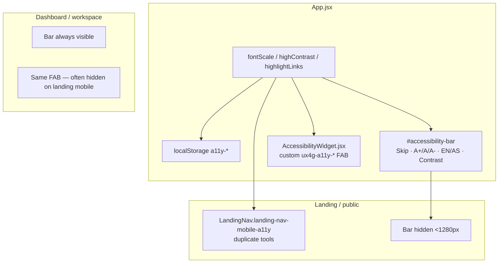
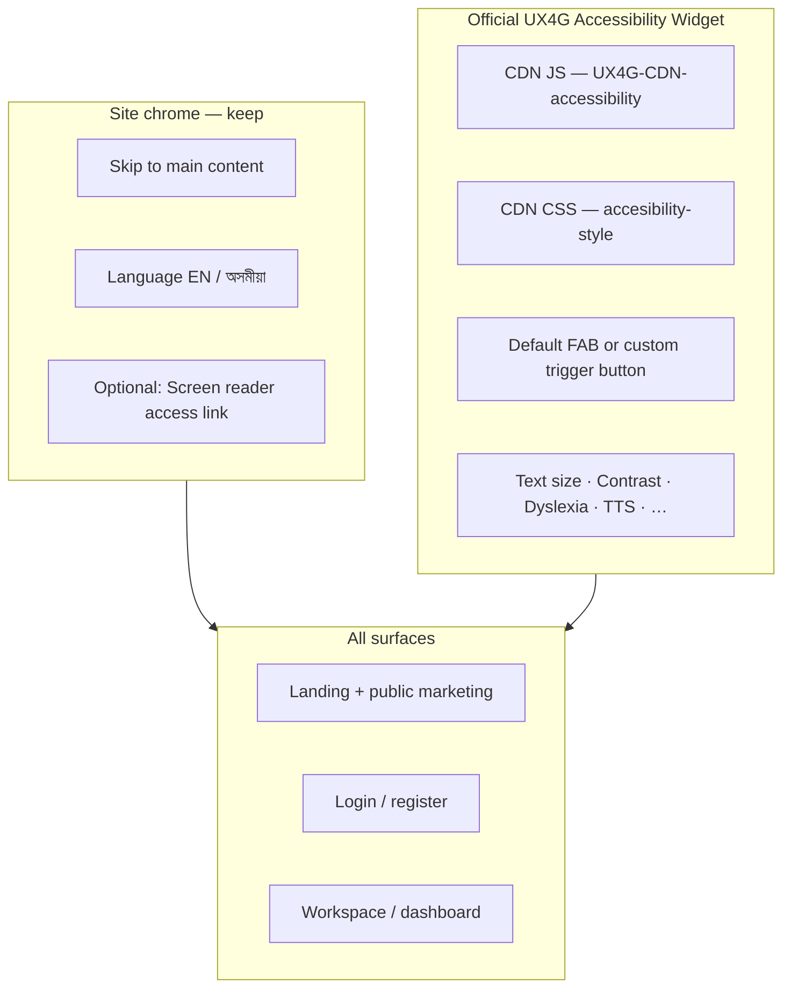

# Accessibility remediation plan — UX4G (Government of India)

**Purpose:** Fix accessibility across the whole Assam Tenancy Registration portal by replacing the custom / partial a11y stack with the **official UX4G Accessibility Widget**, and aligning the remaining chrome with **GIGW / WCAG 2.1 AA / IS 17802**.

**Audience:** NIC frontend team, reviewers, GIGW compliance leads.

**Last updated:** 2026-07-16

**Official references:**

- [UX4G Accessibility Widget docs](https://doc.ux4g.gov.in/ux4g-accessibility/accessibility-widgets.php)
- [UX4G Design System](https://www.ux4g.gov.in/designsystem)
- GIGW 3.0 — Guidelines for Indian Government Websites (WCAG 2.1 Level AA)
- IS 17802 — Indian Standard on ICT accessibility

**Related docs:**

- [frontend-modernization-roadmap.md](./frontend-modernization-roadmap.md)
- [css-architecture-plan.md](./css-architecture-plan.md)
- [modifyfrontend.md](./modifyfrontend.md) — Phase 3 suggests extracting `styles/a11y.css`

---

## Current status (2026-07-21)

**Phases 1–2 started / MVP cutover done in code:**

- Official UX4G CDN CSS + JS loaded from `frontend/index.html`
- `Ux4gAccessibility.jsx` ensures SPA reloads still have assets
- Custom purple FAB (`AccessibilityWidget.jsx`) **removed**
- Top utility strip is **skip + language only** (A+/contrast removed)
- Landing mobile duplicate A+/contrast strip **removed**
- `landingA11y.js` bridge **removed**

**Still open:** CSP allowlist for DigiLocker CDN, dark-mode portal overrides if needed, GIGW content audit (Phase 4).

---

## Executive summary

Today the app has **three overlapping accessibility UIs** plus home-grown font/contrast logic. That causes inconsistent behaviour (especially landing vs dashboard), duplicate controls, CSS fights, and incomplete GIGW coverage (no dyslexia font, text-to-speech, spacing, etc.).

**Direction:** Adopt the **original UX4G Accessibility Widget (CDN)** as the single advanced a11y surface system-wide. Keep only a thin **government utility strip** for skip-to-content + language (and optionally screen-reader access link). Remove the custom purple FAB panel and duplicate mobile toolbars that re-implement UX4G features.

---

## Current state (as-is)



### What exists today

| Layer | Location | Role |
| ----- | -------- | ---- |
| Top utility strip | `App.jsx` → `#accessibility-bar` + large CSS in `App.css` | Skip, font A+/A/A−, language, contrast |
| Mobile landing strip | `LandingNav.jsx` → `.landing-nav-mobile-a11y` | Duplicate of font / contrast / language; global bar hidden ≤1279px |
| Custom “UX4G-style” FAB | `AccessibilityWidget.jsx` + `.ux4g-a11y-*` in `App.css` | Purple floating panel — **not** the official UX4G CDN widget |
| Body classes | `a11y-contrast-high`, `a11y-highlight-links`, `html` font-size | Home-grown effects |

### Problems

1. **Not official UX4G** — Custom FAB mimics branding/name only; missing official features (TTS, dyslexia-friendly, line height, etc.) and gets no MeitY/NeGD updates.
2. **Triplicate controls** — Same actions in bar + mobile strip + FAB; landing hides one and shows another → “dashboard works, landing breaks” reports.
3. **CSS conflicts** — Landing overrides (white bar, terracotta active, button resets) fight Assam/GoI strip styles; FAB purple theme conflicts with portal brand.
4. **Incomplete GIGW posture** — Widget alone does not equal compliance, but without the official toolkit the gap is larger.
5. **No CDN / CSP story** — `index.html` has no UX4G accessibility assets; CSP/network allowlists are undefined.
6. **i18n split** — Language lives in the strip; UX4G features do not. Need a clear ownership boundary.

---

## Target state (to-be)



### Principles

1. **One advanced a11y engine:** Official UX4G widget only.
2. **Thin utility strip:** Skip + language (+ optional screen-reader page link). Do **not** duplicate A+/contrast in the strip once UX4G is live.
3. **Same behaviour everywhere:** Landing, public pages, auth, and workspace share one integration.
4. **Language stays ours:** Portal i18n (`en` / `as`) remains in React; UX4G does not replace Assamese content.
5. **Compliance is broader than the widget:** Forms, focus order, labels, colour contrast of content, and keyboard paths still need GIGW work.

---

## Official UX4G integration (source of truth)

Confirm the **latest** script/CSS URLs and version on the live docs before merge (versions change; v2.0 auto-update is planned by UX4G):

**Docs:** [https://doc.ux4g.gov.in/ux4g-accessibility/accessibility-widgets.php](https://doc.ux4g.gov.in/ux4g-accessibility/accessibility-widgets.php)

Typical inclusion (verify against current docs):

```html
<link
  rel="stylesheet"
  href="https://img1.digitallocker.gov.in/ux4g/UX4G-CDN-accessibility/css/accesibility-style-v2.1.css"
/>
<script src="https://img1.digitallocker.gov.in/ux4g/UX4G-CDN-accessibility/js/weights-v1.js"></script>
```

Optional custom trigger (if not using default FAB):

```html
<button
  id="uw-widget-custom-trigger"
  class="uw-widget-custom-trigger"
  type="button"
  aria-label="Accessibility Widget"
  data-uw-trigger="true"
  aria-haspopup="dialog"
>
  Accessibility
</button>
```

```js
document.getElementById('uw-widget-custom-trigger')?.addEventListener('click', () => {
  if (typeof openMain === 'function') openMain()
})
```

**React note:** Load the CDN script once (e.g. `index.html` or a small `Ux4gAccessibility.jsx` that injects the script and cleans up). Do not mount multiple script tags on route change.

---

## Phased plan

### Phase 0 — Inventory & decision lock (0.5 day)

- [ ] Screenshot current bar / mobile strip / FAB on landing + dashboard (desktop + ≤1279px).
- [ ] Confirm with stakeholders: **official UX4G CDN is mandatory** for NIC/GIGW demo/production.
- [ ] Pin CDN version URLs in this doc after checking UX4G site.
- [ ] Note CSP / offline / air-gapped constraints (if any) — may require vendoring the UX4G accessibility assets instead of CDN.

**Exit:** Written decision: CDN vs vendored; strip keeps language + skip only.

---

### Phase 1 — Integrate official UX4G widget (1–2 days)

**Goal:** Widget available on every route.

- [ ] Add UX4G accessibility CSS + JS to `frontend/index.html` (or equivalent Vite plugin / layout shell).
- [ ] Create `frontend/src/components/a11y/Ux4gAccessibility.jsx`:
  - Ensures script loaded once
  - Optional custom trigger wired to `openMain()`
  - Renders on landing **and** workspace (do not hide on mobile)
- [ ] Mount from `App.jsx` once (sibling to routes), not inside landing-only trees.
- [ ] Smoke-test: open widget, toggle contrast / text size, navigate landing → login → dashboard without remount bugs.

**Exit:** Official widget opens on all major surfaces; no console errors from missing CDN.

---

### Phase 2 — Collapse duplicate custom a11y UIs (1–2 days)

**Goal:** Remove competing controls so UX4G is the only advanced panel.

| Remove / retire | Keep |
| --------------- | ---- |
| `AccessibilityWidget.jsx` (custom purple FAB) | Official UX4G widget |
| `.ux4g-a11y-*` CSS block in `App.css` (~purple FAB/panel) | Thin utility strip styles |
| Font A+/A/A− + contrast buttons in `#accessibility-bar` | Skip link + language switch |
| Font / contrast buttons in `.landing-nav-mobile-a11y` | Skip + language on mobile (or rely on UX4G only + keep language in brand row) |
| `App.jsx` state: `fontScale`, `highContrast`, `highlightLinks` **if** fully replaced by UX4G | `language` / `setLanguage` i18n |
| `localStorage` keys `a11y-font-scale`, `a11y-high-contrast` | `a11y-language` (or existing language key) |
| Landing event bridge `emitLandingA11y` for font/contrast | Language + skip only |

- [ ] Slim `#accessibility-bar` markup in `App.jsx`.
- [ ] Slim `LandingNav` mobile a11y strip (or remove strip entirely if UX4G FAB is always visible).
- [ ] Delete unused i18n keys only after UI removal (or leave keys temporarily).
- [ ] Remove CSS that hides FAB on landing mobile (`page-landing-home .ux4g-a11y-fab { display: none }`) — those rules target the **old** custom FAB; clean up after deletion.

**Exit:** One place for advanced a11y (UX4G); strip no longer reimplements text size/contrast.

---

### Phase 3 — Utility strip = GIGW chrome only (1 day)

**Goal:** Stable Assam / GoI top strip that does not fight the landing design.

Recommended strip contents:

1. **Skip to main content** (required)
2. **Language:** English | অসমীয়া (portal i18n)
3. Optional: link to an Accessibility Statement / Screen Reader Access page (GIGW)

Visual rules:

- Prefer a **compact** strip (dark navy `#0b2545` or light Digital India white — pick one and use it **consistently** on landing + dashboard).
- Do **not** put large emblem + multi-line ministry text in the utility strip if branding already exists in LandingNav / workspace (that combination caused landing layout break reports).
- Emblem/ministry branding belongs in header/nav, not the a11y utility row.

- [ ] Unify strip styles in one place (prefer new `frontend/src/styles/a11y.css` — see CSS architecture plan).
- [ ] Same strip behaviour on `page-landing-home`, `page-public-marketing`, and `page-dashboard`.
- [ ] Stop hiding the global strip on landing mobile **or** keep a single mobile language/skip row — never both full toolbars.

**Exit:** Landing and dashboard strips look and behave the same; no layout break at ≥1280 or ≤1279.

---

### Phase 4 — GIGW / WCAG content compliance (ongoing, parallel)

The widget does **not** replace content accessibility. Track separately:

| Area | Actions |
| ---- | ------- |
| Skip targets | Every route has a reliable `#main-content` / `#portal-content` / `#dashboard-primary-content` |
| Focus | Visible `:focus-visible`; modals trap focus; Escape closes |
| Forms | Labels, errors announced, required fields, keyboard-only UIN + service forms |
| Colour | Brand colours meet AA on text; don’t rely on colour alone for status |
| Images | Meaningful `alt`; decorative `alt=""` |
| Language | `<html lang>` updates when switching EN/AS |
| Motion | Respect `prefers-reduced-motion` on landing hero |
| Statement | Public Accessibility Statement page linked from strip/footer |

- [ ] Run axe / WAVE / Lighthouse a11y on landing, login, citizen dashboard, one official inbox.
- [ ] Fix critical/serious issues before calling GIGW “ready.”

**Exit:** Documented audit checklist with pass/fail; critical defects closed.

---

### Phase 5 — Hardening for production (1 day)

- [ ] CSP: allow `img1.digitallocker.gov.in` / `cdn.ux4g.gov.in` (or self-host assets).
- [ ] Document upgrade path when UX4G publishes widget **v2.0** (auto-update).
- [ ] Prefer reduced-motion and print styles not broken by widget CSS.
- [ ] Confirm widget z-index above workspace topbar but below blocking modals (profile picker, auth).
- [ ] Add short QA script to `Demo_NIC_Credentials.md` or a11y section in this doc.

**Exit:** CSP + z-index + upgrade notes written; smoke QA signed off.

---

## File change map (expected)

| File / area | Change |
| ----------- | ------ |
| `frontend/index.html` | Add UX4G a11y CSS (+ optionally JS) |
| `frontend/src/components/a11y/Ux4gAccessibility.jsx` | **New** — official widget bootstrap |
| `frontend/src/App.jsx` | Mount UX4G; slim accessibility bar; remove custom FAB + font/contrast state |
| `frontend/src/components/landing/AccessibilityWidget.jsx` | **Delete** after cutover |
| `frontend/src/components/landing/LandingNav.jsx` | Remove duplicate font/contrast tools |
| `frontend/src/App.css` | Delete `.ux4g-a11y-*` custom panel; slim bar CSS; extract to `styles/a11y.css` later |
| `frontend/src/i18n/messages/en.js` / `as.js` | Keep language/skip strings; drop unused FAB strings when safe |
| CSP / nginx / Apache config | Allow UX4G CDN if used |

---

## What NOT to do

- Do not rebuild another custom “UX4G-looking” purple FAB.
- Do not keep A+/contrast in three places “for convenience.”
- Do not load the UX4G script only on the landing page.
- Do not treat the widget as full GIGW certification.
- Do not mix UX4G Design System CSS (`ux4g-min.css`) into the whole app unless there is a separate design-system adoption project — this plan is about the **accessibility widget** only.

---

## Testing checklist

| Surface | Width | Checks |
| ------- | ----- | ------ |
| Landing `/` | ≥1280 | Strip: skip + language; UX4G opens; no duplicate A+ row |
| Landing `/` | ≤1279 | UX4G available; language still reachable; no double strips |
| Public `/about` etc. | both | Same as landing |
| Login / register | both | Widget + language; auth forms usable with large text |
| Citizen dashboard | both | Widget above workspace chrome; skip lands in main |
| Official / admin | both | Same; modals still usable |
| Language switch | — | EN ↔ AS updates UI; `<html lang>` correct |
| Keyboard | — | Tab to skip, language, UX4G trigger; Escape closes widget |
| Reduced motion | — | Hero does not fight widget |

---

## Suggested timeline

| Phase | Effort | Owner |
| ----- | ------ | ----- |
| 0 Decision + URL pin | 0.5 day | Lead + NIC |
| 1 Official widget | 1–2 days | Frontend |
| 2 Remove duplicates | 1–2 days | Frontend |
| 3 Strip unify | 1 day | Frontend |
| 4 Content GIGW audit | Ongoing | Frontend + QA |
| 5 Production harden | 1 day | Frontend + DevOps |

**MVP cutover:** Phases 0–3.  
**Compliance depth:** Phase 4+.

---

## Success criteria

1. Official UX4G Accessibility Widget is the only advanced a11y UI on all routes.
2. Utility strip only handles skip + language (optional statement link).
3. No custom `.ux4g-a11y-fab` / `AccessibilityWidget.jsx`.
4. Landing and dashboard a11y chrome behave consistently (no “landing breaks” from duplicate bars).
5. Critical axe/WAVE issues on primary citizen flows are resolved or tracked.
6. CDN version and upgrade path documented here.

---

## Open questions

1. **CDN vs vendored assets** for Assam NIC hosting / air-gap?
2. Keep a **visible** Assam dark utility strip, or rely entirely on UX4G FAB + a minimal skip link?
3. Should **Screen Reader Access** be a dedicated public page before GIGW audit?
4. Does NIC require UX4G Design System (components) later, or accessibility widget only for now?
