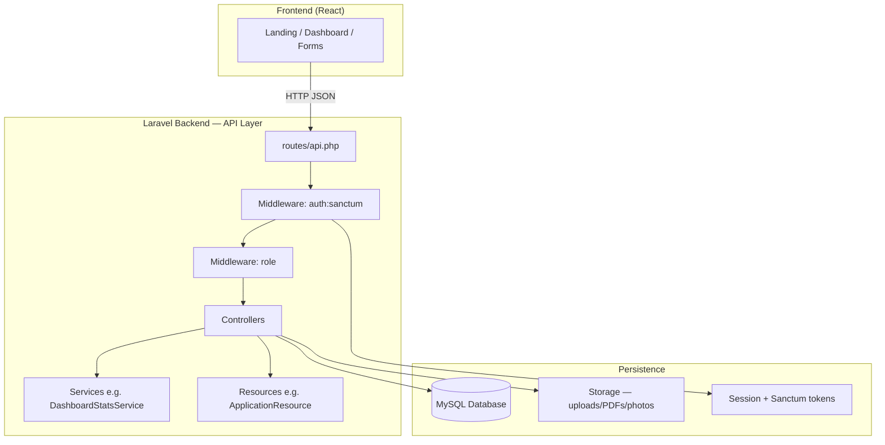
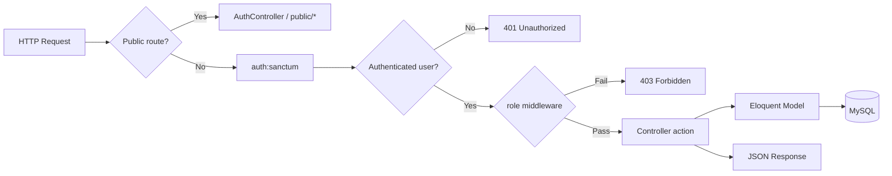
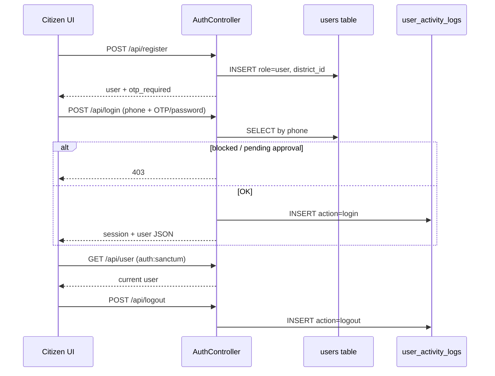
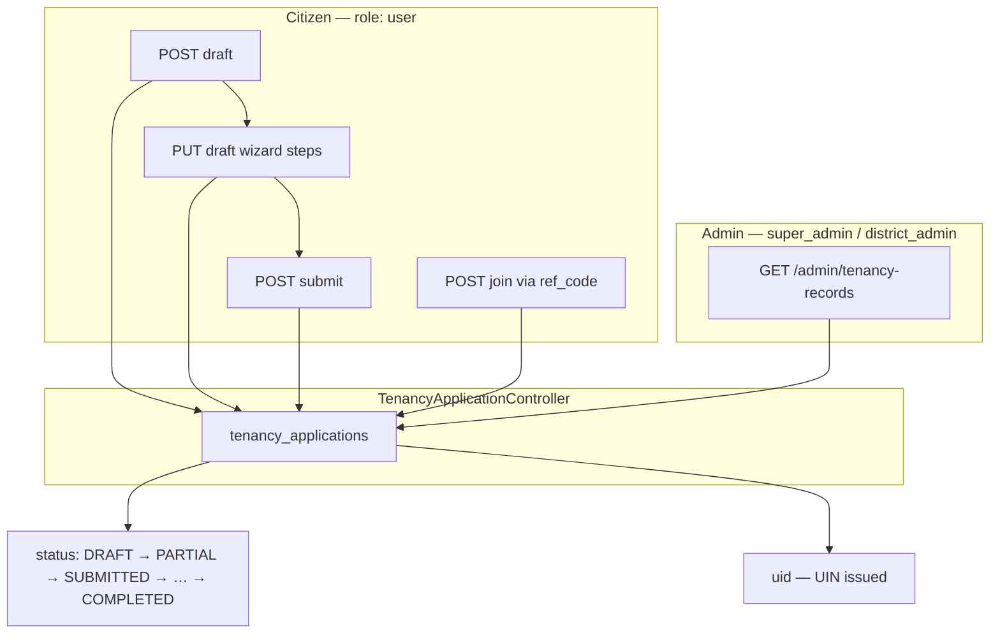
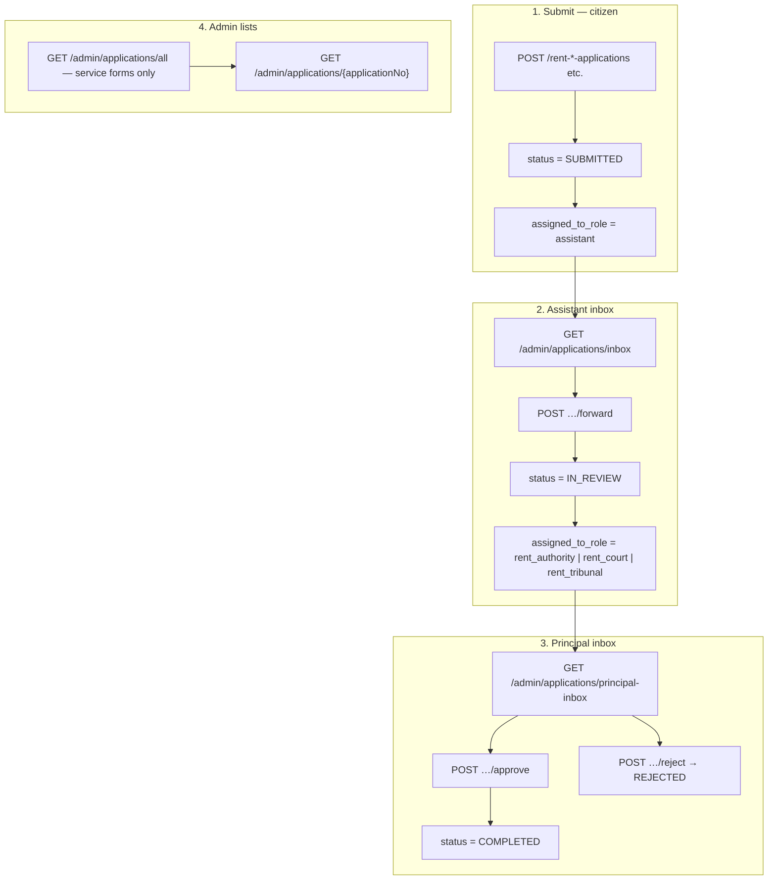
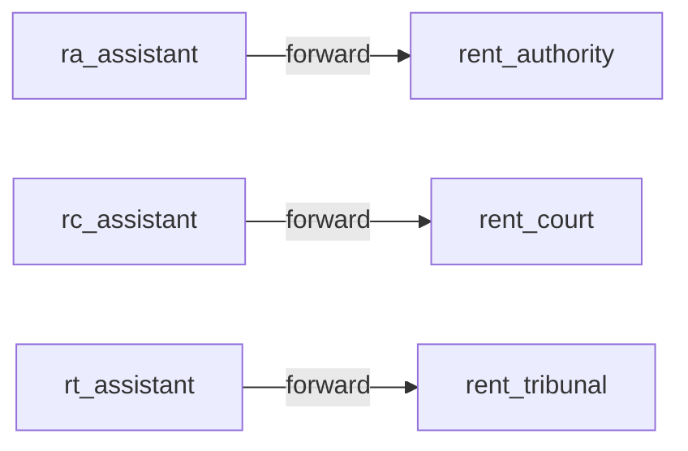
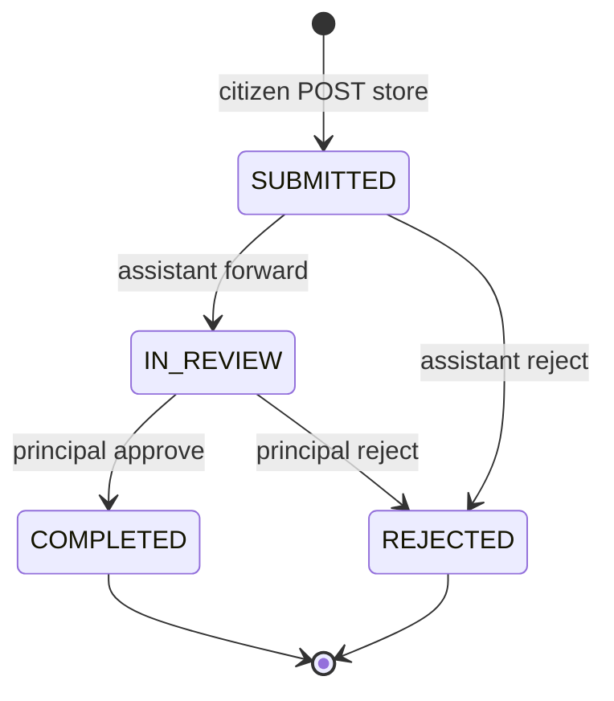
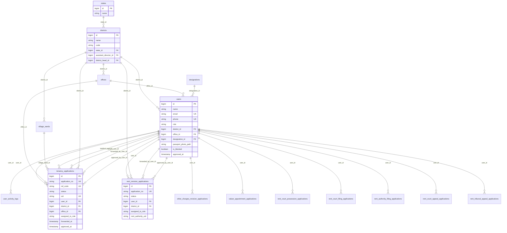
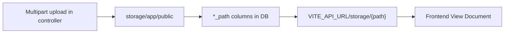

# Backend Architecture — Tenancy Portal (Assam)

Laravel API (`backend/`) with React frontend. This document maps **API flows**, **role-based access**, **application workflows**, and **database relationships**.

---

## 1. System overview

**Keywords:** `Sanctum`, `session cookie`, `role-based access`, `REST API`, `Eloquent ORM`

---

## 2. Request pipeline (every protected call)

### Role groups (`app/Constants/Roles.php`)

| Keyword | Roles |
|--------|--------|
| `citizen` | `user` |
| `assistant` | `ra_assistant`, `rc_assistant`, `rt_assistant` |
| `principal` | `rent_authority`, `rent_court`, `rent_tribunal` |
| `admin` | `super_admin`, `district_admin` |
| `management` | admins + principals |
| `allStaff` | assistants + principals |
| `allAdminStaff` | admins + all staff |

Middleware: `app/Http/Middleware/EnsureRole.php` (registered as `role` in `Kernel.php`).

---

## 3. Authentication & profile flow

### Public routes (no auth)

| Method | Path | Controller |
|--------|------|------------|
| POST | `/api/register` | `AuthController@register` |
| POST | `/api/login` | `AuthController@login` |
| GET | `/api/public/states` | `StateController@publicIndex` |
| GET | `/api/public/districts` | `DistrictController@publicIndex` |
| GET | `/api/public/offices` | `OfficeController@publicIndex` |
| GET | `/api/public/village-wards` | `VillageWardController@publicIndex` |
| GET | `/api/tenancy-applications/{id}/receipt` | `TenancyApplicationController@receipt` |
| GET | `/api/tenancy-applications/{id}/application-details` | `TenancyApplicationController@applicationDetails` |

### Authenticated profile

| Method | Path | Role | Controller |
|--------|------|------|------------|
| GET | `/api/profile` | `user` | `ProfileController@show` |
| PUT | `/api/profile` | `user` | `ProfileController@update` |
| GET | `/api/user` | any | `AuthController@user` |
| POST | `/api/logout` | any | `AuthController@logout` |

**Keywords:** `phone`, `OTP` (prototype: `123456`), `is_blocked`, `approved_at`, session guard `web`

---

## 4. UIN / Tenancy certificate flow

Separate from Assam Tenancy Act **service forms**. Handled by `TenancyApplicationController`.

### Key routes

| Method | Path | Purpose |
|--------|------|---------|
| GET | `/api/tenancy-applications/my` | Citizen's applications |
| GET | `/api/tenancy-applications/draft/current` | Current draft |
| POST | `/api/tenancy-applications/draft` | Create draft |
| PUT/POST | `/api/tenancy-applications/{id}/draft` | Update wizard |
| POST | `/api/tenancy-applications/{id}/submit` | Submit |
| POST | `/api/tenancy-applications/join` | Second party join |
| GET | `/api/tenancy-applications/{id}/acknowledgement` | PDF acknowledgement |
| GET | `/api/admin/tenancy-records` | Admin list (UIN only) |

### Tenancy table keywords (`tenancy_applications`)

- `application_no`, `ref_code`, `status`, `uid`
- `user_id`, `district_id`, `office_id`, `village_ward_id`
- `initiator_role`, `initiator_completed`, `second_party_completed`
- `landlord_user_id`, `tenant_user_id`
- `wizard_step`, `movement_history`, `current_with`
- Workflow: `forwarded_at`, `forwarded_by_user_id`, `approved_at`, `approved_by_user_id`, `assigned_to_role`
- Files: `agreement_pdf_path`, photo/signature paths, PAN/Aadhaar paths

**Form type constant:** `ApplicationTypes::TENANCY_CERTIFICATE` → `'tenancy'`

---

## 5. Service application workflow

Rent Authority / Rent Court / Rent Tribunal forms. Handled by per-form controllers + `ApplicationWorkflowController`.

### Assistant → principal routing

### Workflow API (`ApplicationWorkflowController`)

| Method | Path | Who |
|--------|------|-----|
| GET | `/api/admin/applications/inbox` | assistants |
| GET | `/api/admin/applications/principal-inbox` | principals |
| GET | `/api/admin/applications/all` | super_admin, district_admin (no UIN) |
| GET | `/api/admin/applications/{applicationNo}` | staff + admin |
| GET | `/api/admin/applications/{type}/{id}` | staff + admin |
| POST | `/api/admin/applications/{type}/{id}/forward` | assistants |
| POST | `/api/admin/applications/{type}/{id}/reject` | staff |
| POST | `/api/admin/applications/{type}/{id}/approve` | principals |

**Keywords:** `district_id` scoping, `ApplicationResource`, `form_type` discriminator

---

## 6. Form type → database table mapping

From `app/Constants/ApplicationTypes.php`:

| Keyword | `form_type` | DB table | Default assistant |
|---------|-------------|----------|-------------------|
| UIN | `tenancy` | `tenancy_applications` | — |
| Form I | `form-i-rent-revision` | `rent_revision_applications` | `ra_assistant` |
| Form IA | `form-i-a-other-charges-revision` | `other_charges_revision_applications` | `ra_assistant` |
| Form IB | `form-i-b-valuer-appointment` | `valuer_appointment_applications` | `ra_assistant` |
| Form II | `form-ii-rent-court-possession` | `rent_court_possession_applications` | `rc_assistant` |
| Form III | `form-iii-rent-court-filing` | `rent_court_filing_applications` | `rc_assistant` |
| Form IV | `form-iv-rent-authority-filing` | `rent_authority_filing_applications` | `ra_assistant` |
| Form V | `form-v-rent-court-appeal` | `rent_court_appeal_applications` | `rc_assistant` |
| Form VI | `form-vi-rent-tribunal-appeal` | `rent_tribunal_appeal_applications` | `rt_assistant` |

`ApplicationTypes::serviceForms()` = all types **except** `tenancy` (used for Service applications admin list).

### Citizen submit routes (`role:user`)

- `POST /api/rent-revision-applications`
- `POST /api/other-charges-revision-applications`
- `POST /api/valuer-appointment-applications`
- `POST /api/rent-court-possession-applications`
- `POST /api/rent-court-filing-applications`
- `POST /api/rent-authority-filing-applications`
- `POST /api/rent-court-appeal-applications`
- `POST /api/rent-tribunal-appeal-applications`

Each has matching `GET /api/{resource}/{id}` for the owner.

### Unified citizen list

`GET /api/tenant-forms/my` → `TenantFormsStatusController` (aggregates tenancy + all service forms for dashboard).

---

## 7. Status state machine (service applications)

From `app/Constants/Status.php`:

**Tenancy (UIN)** also uses: `DRAFT`, `PARTIAL`, `PENDING`, `UNDER_PROCESS`, `APPROVED`, etc. — primarily in `TenancyApplicationController`.

---

## 8. Admin & dashboard API map

```mermaid
flowchart TB
    subgraph SUPER["super_admin"]
        DS[dashboard-stats]
        AL[activity-logs]
        CRUD[districts / offices / designations / roles]
        TA[tenancy-records]
        SA[applications/all]
    end

    subgraph DIST["district_admin"]
        TA2[tenancy-records scoped]
        SA2[applications/all scoped]
        ST[staff-dashboard-stats]
    end

    subgraph STAFF["assistants + principals + district_admin"]
        IN[inbox / principal-inbox]
        WF[forward / reject / approve]
        ST2[staff-dashboard-stats]
    end

    subgraph MGMT["management roles"]
        UM[users CRUD]
    end

    DS --> DashboardController
    ST & ST2 --> DashboardController
    IN & WF --> ApplicationWorkflowController
    UM --> UserManagementController
```

| Method | Path | Roles | Controller |
|--------|------|-------|------------|
| GET | `/api/dashboard-stats` | `super_admin` | `DashboardController@stats` |
| GET | `/api/staff-dashboard-stats` | admin + staff | `DashboardController@staffStats` |
| GET | `/api/activity-logs` | `super_admin` | `UserActivityLogController@index` |
| GET/POST/PUT/DELETE | `/api/districts` | `super_admin` | `DistrictController` |
| GET/POST/PUT/DELETE | `/api/offices` | `super_admin` | `OfficeController` |
| GET/POST/PUT/DELETE | `/api/designations` | `super_admin` | `DesignationController` |
| GET/POST/PUT/DELETE | `/api/roles` | `super_admin` | `RoleController` |
| GET/POST/PUT/DELETE | `/api/users` | management | `UserManagementController` |

Stats aggregation: `app/Services/DashboardStatsService.php` (counts by district, status, form type, role-specific models).

---

## 9. Database ER diagram (core relationships)

### Master data tables

| Table | Purpose |
|-------|---------|
| `states` | State master (Assam) |
| `districts` | District master + admin FKs |
| `offices` | Rent offices per district |
| `village_wards` | Locality lookup |
| `designations` | Staff designation labels |
| `roles` | Role name registry |
| `user_activity_logs` | Login/logout audit |
| `personal_access_tokens` | Sanctum (if used) |
| `password_resets` | Legacy password reset |

### Shared workflow columns (all application tables)

Added via migrations `add_workflow_fields_to_service_applications` and `add_approval_fields_to_service_applications`:

- `district_id` → `districts`
- `forwarded_at`, `forwarded_by_user_id`
- `rejected_at`, `rejected_by_user_id`, `rejection_message`
- `assigned_to_role`
- `approved_at`, `approved_by_user_id`
- `status`

Service tables also have `user_id` → `users` (citizen applicant).

---

## 10. File storage flow

**Examples:** `passport_photo_path`, `signature_image_path`, `agreement_pdf_path`, PAN/Aadhaar paths on `tenancy_applications`.

---

## 11. Controller quick reference

| Area | Controller | Keywords |
|------|------------|----------|
| Auth | `AuthController` | login, register, OTP, session |
| UIN | `TenancyApplicationController` | draft, join, submit, UIN, acknowledgement |
| Service forms | `RentRevisionApplicationController`, `OtherChargesRevisionApplicationController`, `ValuerAppointmentApplicationController`, `RentCourtPossessionApplicationController`, `RentCourtFilingApplicationController`, `RentAuthorityFilingApplicationController`, `RentCourtAppealApplicationController`, `RentTribunalAppealApplicationController` | store, show |
| Workflow | `ApplicationWorkflowController` | inbox, forward, approve, reject, allApplications |
| Citizen aggregate | `TenantFormsStatusController` | tenant-forms/my |
| Admin users | `UserManagementController` | staff CRUD, hierarchy |
| Stats | `DashboardController`, `DashboardStatsService` | statewide / district stats |
| Master data | `DistrictController`, `OfficeController`, `StateController`, `VillageWardController`, `DesignationController`, `RoleController` | CRUD / public read |
| Profile | `ProfileController` | citizen profile |
| Activity | `UserActivityLogController` | super_admin logs |

---

## 12. Key source files

| File | Role |
|------|------|
| `backend/routes/api.php` | All API route definitions + middleware groups |
| `backend/app/Constants/Roles.php` | Role constants and group helpers |
| `backend/app/Constants/ApplicationTypes.php` | Form type slugs + `serviceForms()` |
| `backend/app/Constants/Status.php` | Application status constants |
| `backend/app/Http/Controllers/ApplicationWorkflowController.php` | Service form workflow |
| `backend/app/Http/Controllers/TenancyApplicationController.php` | UIN / tenancy certificate |
| `backend/app/Http/Resources/ApplicationResource.php` | Normalized application JSON |
| `backend/database/migrations/` | Schema history |

---

*Generated from the tenant-system-prototype codebase. Mermaid diagrams render in GitHub, GitLab, VS Code, and Cursor.*
