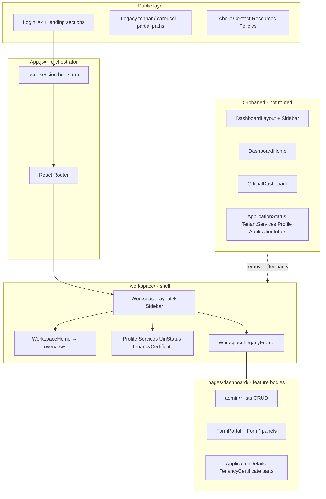

# Frontend Modernization & Legacy Removal Roadmap

**Purpose:** Plan how to retire legacy dashboard code safely, restructure the React frontend for long-term consistency, and record an honest assessment of the **overall system** today—including gaps and ratings.

**Audience:** NIC dev team, reviewers, future maintainers.

**Last reviewed:** 2026-06-03

**Related docs:**

- [backend-architecture.md](./backend-architecture.md) — API, roles, workflows
- [super-admin-reference.md](./super-admin-reference.md) — super admin powers and product gaps
- [legacy-code-map.md](./legacy-code-map.md) — where legacy lives, how it’s used, how it breaks workspace
- [accessibility-ux4g-plan.md](./accessibility-ux4g-plan.md) — fix a11y system-wide with official UX4G widget (GIGW)
- [frontend-remaining-work.md](./frontend-remaining-work.md) — living checklist of unfinished frontend work
- [Demo_NIC_Credentials.md](../Demo_NIC_Credentials.md) — demo logins (some screens described there are not routed)

---

## Executive summary

The product is a **working prototype**: citizen landing + login, workspace shell for post-login UX, Laravel API with role middleware, and multi-role application workflows. The main risk is **technical debt from a half-finished migration**—`workspace/` wraps old `pages/dashboard/*` pages while orphaned layouts, duplicate pages, dead imports, and ~20k lines of global CSS remain.

**Recommended direction:** Treat `workspace/` as the **canonical** post-login shell (invert the comment in `workspace/index.js`), migrate feature pages **into** `workspace/features/*`, delete legacy shells only after route parity and smoke tests—not a big-bang rewrite.

---

## Overall system rating (prototype snapshot)

Scores are **relative to a production government portal**, not “demo quality.” Scale: **1** = unusable / unsafe, **5** = acceptable prototype, **8** = production-ready baseline, **10** = exemplary.

| Dimension | Score | Summary |
| --------- | ----- | ------- |
| **End-to-end product (demo)** | **7 / 10** | Core flows work: register/login, UIN tenancy, service forms, official inbox, principals approve, admin oversight. Good for stakeholder demos. |
| **Frontend architecture** | **5 / 10** | Partial workspace migration; dual CSS systems; `App.jsx` owns too much; no feature-based folders or shared data layer. |
| **Backend architecture** | **7 / 10** | Clear `api.php` grouping, `Roles` constants, workflow controller, documented in `backend-architecture.md`. Some routes missing (user approve/block). |
| **UI/UX consistency** | **6 / 10** | Landing/workspace look modern; legacy-wrapped admin pages still use `auth-card` / `dashboard-card` patterns inside `ws-legacy-page`. |
| **Security & operations** | **4 / 10** | Demo OTP, password fallback, weak delete/RBAC on users, no observability story in repo. |
| **Maintainability** | **5 / 10** | Large page files, duplicated dashboards, dead files, deep relative imports (`../../../`). |
| **Documentation** | **6 / 10** | Backend doc strong; demo credentials partly stale; new role/reference docs improving. |
| **Testability** | **3 / 10** | Little automated frontend coverage visible; manual demo testing assumed. |

### **Composite (weighted toward production readiness): 5.5 / 10**

**Verdict:** Strong **NIC prototype** for flows and roles; **not** ready for production without auth hardening, frontend consolidation, API completeness, and automated regression tests.

---

## Current architecture (as-is)



### Styles (three globals)

| File | ~Lines | Used by |
| ---- | ------ | ------- |
| `index.css` | 3,200+ | Global base |
| `App.css` | 15,600+ | Landing, legacy cards, public chrome |
| `workspace/styles/workspace.css` | 4,360+ | `.ws-*` workspace |

**~23k lines** of hand-written CSS, no design-token package, almost no co-located CSS modules.

### Data & state

- **API:** single `api.js` (axios + Sanctum); ~35 files call endpoints directly.
- **State:** `App.jsx` holds `user`; outlet context for dashboard; per-page `useState`; one small context (`AuthPanelNavigationContext`).
- **No** React Query / Zustand / centralized `services/` layer.

---

## System-wide gaps (frontend + backend + docs)

### Critical (block production or cause bugs)

| Gap | Where | Impact |
| --- | ----- | ------ |
| User **approve** / **toggle-block** API not registered | `UserManagementController` exists; routes missing in `api.php` | Super admin UI actions fail |
| Demo OTP / password fallback | `AuthController`, `Demo_NIC_Credentials.md` | Not secure for go-live |
| `Demo_NIC_Credentials.md` lists admin screens not in router | Docs vs `App.jsx` | Wrong stakeholder expectations |
| No automated E2E / integration tests for role flows | Repo | Regressions during legacy removal |

### High (maintainability & consistency)

| Gap | Where | Impact |
| --- | ----- | ------ |
| Half-migrated workspace | `workspace/` + `pages/dashboard/` | Two sidebars, two home dashboards, confusion |
| Dead imports: `OfficeManagement`, `RoleManagement`, `DesignationManagement`, `ActivityLog`, `Register` | `App.jsx` | Master-data UIs built but unreachable |
| Orphan pages never imported | See [Legacy inventory](#legacy-inventory-delete-only-after-parity) | Noise, wrong mental model |
| `ApplicationInbox.jsx` unused; inbox + applications routes both use `ApplicationList` | `admin/` | Duplicate maintenance |
| `App.jsx` god file (~660+ lines) | Routing, auth, a11y, legacy chrome | Hard to change safely |
| Giant components | e.g. `TenancyCertificate.jsx`, `ApplicationStatus.jsx` | Hard review and testing |
| `:formType` catch-all route | `App.jsx` under `/dashboard` | Footgun if new single-segment paths added |
| Super admin on `allAdminStaffRoles` workflow routes but methods 403 | `api.php` + `ApplicationWorkflowController` | Wider attack surface than needed |

### Medium (polish & future scale)

| Gap | Notes |
| --- | ----- |
| Assamese i18n stub | Button disabled; no message catalogs |
| `/admin` public page vs `/dashboard/admin/*` | Two “admin” concepts |
| `UserDetail` at `/users/:id` outside workspace shell | Inconsistent chrome for super admin |
| Pagination/filtering inconsistent | Some lists client-merge paginate in PHP |
| Activity log API without full UI | Oversight incomplete |
| `console.log` left in `ApplicationStatus.jsx` | Debug leakage |

### Low (cleanup when convenient)

| Gap | Notes |
| --- | ----- |
| Commented footer block in `App.jsx` | Delete when confirmed unused |
| Commented `StateManagement` import | Wire or remove file |
| `workspace/index.js` comment says “delete workspace” | Outdated; invert intent in docs + comment |

---

## Target frontend structure (end state)

Goal: **feature folders** + **thin app shell** + **shared kit**. Names can be adjusted; principles matter.

```
frontend/src/
├── app/
│   ├── App.jsx                 # Providers + top-level router only
│   ├── routes/
│   │   ├── public.routes.jsx
│   │   ├── dashboard.routes.jsx
│   │   └── index.jsx
│   └── providers/
│       ├── AuthProvider.jsx
│       └── AccessibilityProvider.jsx
│
├── features/
│   ├── landing/                # Marketing + Login composition
│   ├── auth/                   # Register panel, OTP, session
│   ├── workspace/
│   │   ├── layout/             # WorkspaceLayout, Sidebar, headers
│   │   ├── citizen/            # UIN, services, status, tenancy apply
│   │   ├── official/           # Inbox, applications, workflow actions
│   │   └── admin/              # Users, districts, master data, activity log
│   └── forms/                  # FormPortal + Form* panels (or per-form subfolders)
│
├── shared/
│   ├── api/
│   │   ├── client.js           # axios instance (today's api.js)
│   │   ├── users.js
│   │   ├── applications.js
│   │   └── tenancy.js
│   ├── components/             # Buttons, DataTable, modals used everywhere
│   ├── hooks/                  # useAuth, usePaginatedQuery, etc.
│   ├── constants/
│   └── utils/
│
└── styles/
    ├── tokens.css              # colors, spacing, typography
    ├── global.css
    └── workspace.css           # shrink over time; prefer tokens
```

### Conventions (consistency rules)

1. **One shell** post-login: `WorkspaceLayout` only; no `DashboardLayout` / legacy `Sidebar`.
2. **One component per route concern** — e.g. single inbox page; role-specific columns via config, not duplicate files.
3. **Imports:** use path alias `@/` → `src/` (Vite `resolve.alias`) to end `../../../` chains.
4. **API:** pages call `shared/api/*` only; no raw `api.get` in presentational components.
5. **CSS:** new work uses `ws-*` + tokens; legacy `auth-card` / `dashboard-card` retired per migrated page.
6. **Pages vs features:** `pages/` reserved for **route entry** re-exports only, or eliminated in favor of `features/*/routes`.

---

## Legacy removal strategy (safe order)

**Rule:** Never delete until **route + behavior parity** is verified for that role (manual checklist or E2E).

### Phase 0 — Baseline (1–2 days)

- [ ] Generate **route map**: all `App.jsx` paths → component file → API calls used.
- [ ] Add **smoke checklist** per role (citizen, each assistant, each principal, DA, super admin) — link from `Demo_NIC_Credentials.md`.
- [ ] Fix **broken APIs** used by UI (`users/{id}/approve`, `users/{id}/toggle-block`) before large deletes.
- [ ] Update `Demo_NIC_Credentials.md` to match routed screens.

**Exit:** Documented parity matrix; critical API routes work.

### Phase 1 — Remove confirmed dead code (low risk)

Delete only files with **zero imports** and **no route** (verify with ripgrep before each delete).

| Candidate file | Reason |
| -------------- | ------ |
| `pages/dashboard/DashboardHome.jsx` | Not imported |
| `components/dashboard/OfficialDashboard.jsx` | Not imported |
| `pages/dashboard/DashboardLayout.jsx` | Superseded by `WorkspaceLayout` (verify no route) |
| `components/dashboard/Sidebar.jsx` | Only used by `DashboardLayout` |
| `pages/Register.jsx` | `/register` redirects to login |
| `pages/dashboard/admin/ApplicationInbox.jsx` | Not routed; inbox uses `ApplicationList` |

Also:

- [ ] Remove dead imports from `App.jsx` (`OfficeManagement`, etc.) **or** wire routes in Phase 3—pick one per item.
- [ ] Remove commented footer + obsolete `workspace/index.js` “delete workspace” comment (replace with “canonical shell”).
- [ ] Remove `console.log` from `ApplicationStatus.jsx` if file kept temporarily.

**Exit:** Smaller bundle, less confusion; CI/build still green.

### Phase 2 — Consolidate duplicates (medium risk)

| Keep (canonical) | Retire after parity |
| ---------------- | ------------------- |
| `workspace/pages/WorkspaceUinStatus.jsx` | `pages/dashboard/ApplicationStatus.jsx` |
| `workspace/pages/WorkspaceServices.jsx` | `pages/dashboard/TenantServices.jsx` |
| `workspace/pages/WorkspaceProfile.jsx` | `pages/dashboard/Profile.jsx` |
| `workspace/pages/official/OfficialOverview.jsx` + `SuperAdminDashboard.jsx` | N/A (already canonical home) |
| Single inbox route strategy | Merge `admin/inbox` vs `admin/applications` UX if redundant |

Steps per page:

1. Compare API calls and UI states side by side.
2. Port missing behavior into workspace page.
3. Switch route in `dashboard.routes` (future) or `App.jsx`.
4. Delete old file + remove `WorkspaceLegacyFrame` wrapper for that route.
5. Run role smoke checklist.

**Exit:** No duplicate citizen/admin paths; fewer `WorkspaceLegacyFrame` usages.

### Phase 3 — Migrate admin & forms out of `pages/dashboard/` (higher effort)

Move bodies into `features/workspace/admin/` and `features/forms/`:

| Current | Target |
| ------- | ------ |
| `admin/UserManagement.jsx` | `features/workspace/admin/users/` |
| `admin/ApplicationList.jsx` | `features/workspace/official/applications/` |
| `admin/TenancyRecords.jsx` | `features/workspace/admin/tenancy/` |
| `admin/DistrictManagement.jsx` | `features/workspace/admin/districts/` |
| `FormPortal.jsx` + `components/Form*.jsx` | `features/forms/` |
| `ApplicationDetails.jsx` | `features/workspace/.../application-detail/` |

For each migration:

- Replace `WorkspaceLegacyFrame` with native `WorkspacePageHeader` + `ws-page` layout.
- Restyle off `auth-card dashboard-card` → `ws-card` patterns.
- Extract table columns and actions into small components.

**Wire or drop** master-data pages:

- `StateManagement`, `OfficeManagement`, `RoleManagement`, `DesignationManagement`, `ActivityLog` — align with [super-admin-reference.md](./super-admin-reference.md).

**Exit:** `pages/dashboard/` empty or deleted; `WorkspaceLegacyFrame` removed.

### Phase 4 — API & state layer (parallel-friendly)

- [ ] Split `api.js` → `shared/api/client.js` + domain modules.
- [ ] Introduce **React Query** (or similar) for lists/stats with shared loading/error UI.
- [ ] `AuthProvider` replaces prop-drilled `user` through `App.jsx`.
- [ ] Optional: OpenAPI or hand-written types for request/response shapes.

**Exit:** Pages mostly orchestration + JSX; fetch logic testable in isolation.

### Phase 5 — `App.jsx` decomposition

- [ ] `app/routes/public.routes.jsx` — landing, policies, resources.
- [ ] `app/routes/dashboard.routes.jsx` — workspace nested routes.
- [ ] `app/providers/` — auth, a11y.
- [ ] Collapse `showLegacyPublicChrome` paths into landing layout or one `PublicLayout`.

**Exit:** `App.jsx` under ~150 lines.

### Phase 6 — CSS modernization (ongoing)

- [ ] Extract **design tokens** (NIC palette already in CSS — centralize variables).
- [ ] Migrate landing-only rules → `styles/landing.css`.
- [ ] Migrate workspace rules only in `workspace.css`; delete duplicated rules from `App.css` as pages migrate.
- [ ] Long-term: CSS modules or scoped CSS per feature (avoid a fourth global file).

**Exit:** `App.css` shrinks materially; new pages do not add to monolith.

### Phase 7 — Hardening & production alignment

- [ ] Real OTP, remove password fallback from production builds.
- [ ] E2E tests for critical paths (Playwright/Cypress).
- [ ] RBAC audit on `UserManagementController::destroy/update`.
- [ ] Remove `super_admin` from workflow mutation middleware if never used.
- [ ] Move `UserDetail` under workspace layout (`/dashboard/admin/users/:id`).

**Exit:** Production readiness gate met.

---

## Legacy inventory (delete only after parity)

| File / area | Status | Action |
| ----------- | ------ | ------ |
| `DashboardHome.jsx` | Orphan | Phase 1 delete |
| `OfficialDashboard.jsx` | Orphan | Phase 1 delete |
| `DashboardLayout.jsx` + `Sidebar.jsx` | Orphan | Phase 1 delete |
| `ApplicationStatus.jsx` | Orphan (route uses `WorkspaceUinStatus`) | Phase 2 delete |
| `TenantServices.jsx` | Orphan | Phase 2 delete |
| `Profile.jsx` (dashboard) | Orphan | Phase 2 delete |
| `ApplicationInbox.jsx` | Orphan | Phase 1 delete |
| `Register.jsx` | Dead route | Phase 1 delete |
| `WorkspaceLegacyFrame.jsx` | Active bridge | Phase 3 remove last |
| `pages/Admin.jsx` | Public `/admin` | Decide: redirect to login or docs-only |
| `UserDetail.jsx` at `/users/:id` | Active, outside workspace | Phase 7 move |
| Master-data admin JSX | Imported, unrouted | Phase 3 wire or delete |
| Legacy public chrome in `App.jsx` | Partial paths | Phase 5 unify |

---

## Risk register (legacy removal)

| Risk | Mitigation |
| ---- | ---------- |
| Delete file still linked dynamically | Ripgrep imports + run `npm run build` |
| `WorkspaceLegacyFrame` hides missing `ws-*` styles | Migrate styles before removing frame |
| Role-specific nav breaks | Test `workspace/config/navigation.js` per role after each route change |
| `:formType` route swallows new paths | Register explicit routes **above** catch-all; consider `/dashboard/forms/:formType` |
| Large CSS deletion breaks landing | Scope deletes to migrated sections only; visual regression on `/login` |
| Backend contract change during UI move | Keep API modules stable; UI-only phases |

---

## Suggested timeline (indicative)

| Phase | Effort (1 dev) | Depends on |
| ----- | -------------- | ---------- |
| 0 Baseline | 1–2 days | — |
| 1 Dead code | 1 day | Phase 0 |
| 2 Duplicates | 3–5 days | Phase 0 |
| 3 Admin/forms migration | 2–3 weeks | Phases 1–2 |
| 4 API layer | 1 week (parallel) | — |
| 5 App split | 3–5 days | Phase 3 mostly done |
| 6 CSS | Ongoing | Per page migrated |
| 7 Hardening | 2+ weeks | Product sign-off |

Total to **maintainable frontend + production gaps**: roughly **4–8 weeks** focused work, excluding new features.

---

## Definition of done (modernized frontend)

- [ ] Single post-login layout (`WorkspaceLayout`).
- [ ] No `WorkspaceLegacyFrame`; no `pages/dashboard/` tree (or only re-exports).
- [ ] No orphaned dashboard files; `App.jsx` delegates to route modules.
- [ ] Shared `api/*` modules; auth via provider.
- [ ] Role smoke tests pass; `Demo_NIC_Credentials.md` accurate.
- [ ] Super-admin master-data screens routed or explicitly descoped.
- [ ] CSS: tokens + workspace/landing split; `App.css` not growing.
- [ ] Documented in this file with **changelog** below.

---

## Changelog

| Date | Change |
| ---- | ------ |
| 2026-06-03 | Initial roadmap: ratings, gaps, phased legacy removal, target structure |
