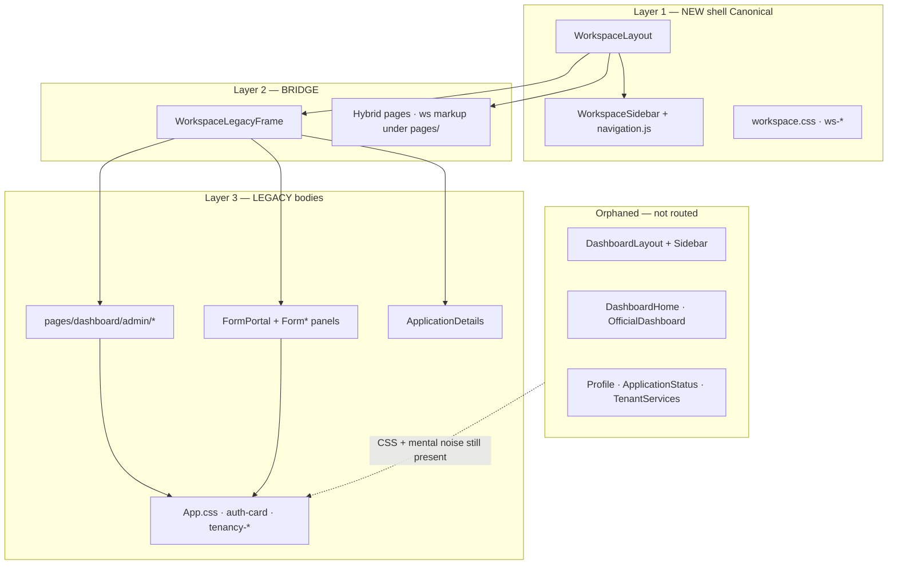

# Legacy code map — what it is, where it runs, how it breaks the new system

**Purpose:** Explain the **legacy frontend stack** still living in this repo: why it exists, how it is used today, where it appears in routes, and how it fights the **new workspace system**.

**Audience:** NIC developers, reviewers, anyone about to “just tweak CSS” or delete a dashboard file.

**Last updated:** 2026-07-16

**Related docs:**

- [legacy-public-shell-reference.md](./legacy-public-shell-reference.md) — undefined routes, HIGHLIGHTS carousel, guest fallback shell
- [app-routes.md](./app-routes.md) — full URL → page map
- [frontend-modernization-roadmap.md](./frontend-modernization-roadmap.md) — migration direction and ratings
- [modifyfrontend.md](./modifyfrontend.md) — CSS conflict / cleanup plan
- [css-architecture-plan.md](./css-architecture-plan.md)
- [accessibility-ux4g-plan.md](./accessibility-ux4g-plan.md) — triplicate a11y UIs

---

## One-sentence truth

**The new system is the workspace shell (`frontend/src/workspace/`). Most real work (admin lists, Form I–VIII, application details) still runs as old `pages/dashboard/*` bodies shoved inside that shell.** Orphaned old shells and a giant `App.css` keep colliding with the new UI.

---

## How we got here

1. Original post-login UI: `DashboardLayout` + `components/dashboard/Sidebar` + pages under `pages/dashboard/`, styled mainly in `App.css` (`.auth-card`, `.dashboard-card`, `.tenancy-*`).
2. A **workspace** redesign was added (`WorkspaceLayout`, `.ws-*`, `workspace.css`) as the new chrome.
3. Migration was **not finished**. Instead of rewriting every page, a bridge was added:

```4:5:frontend/src/workspace/pages/WorkspaceLegacyFrame.jsx
/** Wraps legacy form/status pages in the new workspace chrome. */
function WorkspaceLegacyFrame({
```

4. `App.jsx` now mounts **only** `WorkspaceLayout` for `/dashboard/*`. The old `DashboardLayout` is **no longer routed** — but its files and CSS largely remain.

Outdated comment (wrong direction — do **not** restore `DashboardLayout`):

```1:4:frontend/src/workspace/index.js
/**
 * Workspace UI module — modern post-login shell (Koala-style).
 * To remove later: delete `frontend/src/workspace/` and restore DashboardLayout in App.jsx.
 */
```

**Canonical direction:** keep `workspace/`; migrate feature bodies **into** it; delete legacy shells after parity.

---

## Mental model: three layers



| Layer | Role | Safe to delete? |
| ----- | ---- | --------------- |
| **NEW shell** | Sidebar, topbar, native home/profile/services/status | No — this *is* the product chrome |
| **BRIDGE** | `WorkspaceLegacyFrame` + hybrid UIN/join pages | No until bodies are rewritten |
| **LEGACY bodies** | Admin CRUD, forms, details | Not yet — still live under the bridge |
| **ORPHANED** | Old layout, duplicate Profile/Home/Status | Yes *after* confirming zero imports |

---

## How legacy is used (runtime)

### Entry point

`App.jsx` imports the workspace shell and many legacy page modules, then nests routes under `WorkspaceLayout`.

Flow for a typical admin screen:

1. User hits `/dashboard/admin/users`
2. `WorkspaceLayout` renders sidebar + topbar (new)
3. Outlet renders `WorkspaceLegacyFrame` (bridge)
4. Inside the frame: `UserManagement` from `pages/dashboard/admin/` (legacy markup + `App.css` classes)
5. `workspace.css` patches `.ws-legacy-page .auth-card` / `.dashboard-card` so it looks vaguely modern

Same pattern for inbox, applications, tenancy records, districts, FormPortal, citizen application details.

### Classification of routes

| Route pattern | What renders | Kind |
| ------------- | ------------ | ---- |
| `/dashboard` | `WorkspaceHome` → User / Official / SuperAdmin overview | **Native (new)** |
| `/dashboard/profile` | `WorkspaceProfile` | **Native** |
| `/dashboard/services` | `WorkspaceServices` | **Native** |
| `/dashboard/status` | `WorkspaceUinStatus` | **Native** |
| `/dashboard/tenancy-certificate` | `TenancyCertificate` (no frame) | **Hybrid** — lives under `pages/dashboard/`, uses `ws-uin-*` + `.tenancy-*` |
| `/dashboard/join` | `JoinApplication` | **Hybrid** |
| `/dashboard/status/:type/:applicationNo` | Frame + `ApplicationDetails` | **Legacy-wrapped** |
| `/dashboard/:formType` | Frame + `FormPortal` | **Legacy-wrapped** (catch-all) |
| `/dashboard/admin/users` | Frame + `UserManagement` | **Legacy-wrapped** |
| `/dashboard/admin/inbox` | Frame + `ApplicationList` | **Legacy-wrapped** |
| `/dashboard/admin/applications` | Frame + `ApplicationList` (same component) | **Legacy-wrapped** |
| `/dashboard/admin/applications/:applicationNo` | Frame + `AdminApplicationDetails` | **Legacy-wrapped** |
| `/dashboard/admin/tenancy` | Frame + `TenancyRecords` | **Legacy-wrapped** |
| `/dashboard/admin/districts` | Frame + `DistrictManagement` | **Legacy-wrapped** |

### Shared “legacy folder” components that are still live

Not everything under `components/dashboard/` is dead. These are **shared kit** used by both eras:

- `Icons.jsx`
- `DataTable.jsx`
- `ProfileCompletionModal.jsx`
- `SubmissionSuccessModal.jsx`
- `WorkflowConfirmModal.jsx`
- `StatusProgressViewButton.jsx` / `ApplicationStatusProgress.jsx`

Deleting the folder blindly would break the new workspace.

---

## Where legacy lives (inventory)

### A. Still used (legacy-wrapped or hybrid)

| Path | Used by |
| ---- | ------- |
| `pages/dashboard/FormPortal.jsx` | `/dashboard/:formType` |
| `components/Form*.jsx`, `FormI*.jsx`, etc. | Via FormPortal |
| `pages/dashboard/ApplicationDetails.jsx` | Citizen status detail |
| `pages/dashboard/TenancyCertificate.jsx` | Apply UIN (hybrid) |
| `pages/JoinApplication.jsx` | Invite join (hybrid) |
| `pages/dashboard/admin/UserManagement.jsx` | Users |
| `pages/dashboard/admin/ApplicationList.jsx` | Inbox + Applications |
| `pages/dashboard/admin/AdminApplicationDetails.jsx` (+ Page wrapper) | Admin detail |
| `pages/dashboard/admin/TenancyRecords.jsx` | Tenancy list |
| `pages/dashboard/admin/DistrictManagement.jsx` | Districts |
| `styles/service-forms.css` | Form I–VIII scoping |
| Large parts of `App.css` | Cards, tables, tenancy, landing, a11y |

### B. Orphaned — not routed (dead shells / duplicates)

| Path | Was | Replaced by |
| ---- | --- | ----------- |
| `pages/dashboard/DashboardLayout.jsx` | Old shell | `WorkspaceLayout` |
| `components/dashboard/Sidebar.jsx` | Old nav | `WorkspaceSidebar` |
| `pages/dashboard/DashboardHome.jsx` | Old home | `WorkspaceHome` + overviews |
| `components/dashboard/OfficialDashboard.jsx` | Old official home | `OfficialOverview` |
| `pages/dashboard/Profile.jsx` | Old profile | `WorkspaceProfile` |
| `pages/dashboard/ApplicationStatus.jsx` | Old UIN status (deleted) | `WorkspaceUinStatus` |
| `pages/dashboard/TenantServices.jsx` | Old services catalog | `WorkspaceServices` |
| `pages/dashboard/admin/ApplicationInbox.jsx` | Separate inbox UI | Same `ApplicationList` as applications |
| `pages/dashboard/admin/StateManagement.jsx` | Master data | Not wired (import commented) |

### C. Dead imports in `App.jsx` (imported, never rendered)

These inflate the mental model (“we have Role Management”) but have **no route**:

- `OfficeManagement.jsx`
- `RoleManagement.jsx`
- `DesignationManagement.jsx`
- `ActivityLog.jsx`
- `Register.jsx` (`/register` redirects to `/login`)

---

## How legacy breaks the new system

### 1. Two UIs, one URL space

Users see the **new** sidebar and topbar, then a **legacy** card/table body. Designers and testers report “inconsistent dashboard,” because chrome and content belong to different eras.

### 2. CSS war (`App.css` vs `workspace.css` vs `service-forms.css`)

Load order (simplified):

```text
index.css → App.css → service-forms.css → workspace.css
```

Shared class names (especially `.tenancy-form`, `.tenancy-fieldset`, `.form-actions`) are:

- Defined for old tenancy / forms in **App.css**
- Re-scoped under `.service-form-*` in **service-forms.css**
- Overridden again under `.ws-uin-apply` / `.ws-legacy-page` in **workspace.css**

Effects:

- Changing Apply UIN layout can break Form I–VIII (and reverse)
- Mobile padding, button widths, and disabled states “randomly” regress
- Hundreds of `!important` rules make fixes brittle
- Dead `.dashboard-layout` rules still sit in App.css and confuse greps

See [modifyfrontend.md](./modifyfrontend.md) for the cleanup phases.

### 3. Duplicate pages = wrong file edits

Common trap: edit `pages/dashboard/Profile.jsx` — **nothing changes in the browser**, because the live route uses `WorkspaceProfile`. (`ApplicationStatus.jsx` is deleted; status is `WorkspaceUinStatus`.)

Same for `Sidebar.jsx` vs `WorkspaceSidebar.jsx`.

### 4. Bridge band-aids hide debt

`WorkspaceLegacyFrame` + `.ws-legacy-page` overrides make old cards look acceptable without migrating markup. That:

- Encourages more legacy pages to be “wrapped” instead of rewritten
- Increases CSS specificity forever
- Blocks deleting App.css tenancy/admin sections

### 5. Catch-all form route footgun

`/dashboard/:formType` catches any single segment under dashboard. A new path like `/dashboard/reports` can accidentally open `FormPortal` unless routing is careful.

### 6. Accessibility triplicate

Legacy + landing + custom FAB overlap:

| Surface | Control |
| ------- | ------- |
| Global `#accessibility-bar` | Skip, A+/A, language, contrast |
| Landing mobile strip | Duplicate tools |
| Custom `AccessibilityWidget` | Purple FAB (not official UX4G) |

Dashboard and landing behave differently; CSS overrides “break” landing while dashboard looks fine. Plan: [accessibility-ux4g-plan.md](./accessibility-ux4g-plan.md).

### 7. Docs and comments lie

- `workspace/index.js` still says delete workspace / restore DashboardLayout
- Demo credentials may list screens that are imported but not routed (Role/Office management)
- Orphan files look like the “real” implementation in search results

### 8. Bundle and review cost

Dead pages and unused imports stay in the tree. Code review, search, and onboarding all pay for two systems.

---

## What “legacy” does *not* mean

| Myth | Reality |
| ---- | ------- |
| “Everything under `pages/dashboard/` is dead” | **False** — admin + forms + details are live via LegacyFrame |
| “Everything under `components/dashboard/` can be deleted” | **False** — shared modals/icons/tables are live |
| “Workspace replaced App.css” | **False** — App.css still owns landing + most legacy body styles |
| “Hybrid UIN is fully new” | **Partial** — uses `ws-*` but still depends on `.tenancy-*` from App.css |

---

## How to work safely (rules of thumb)

1. **Changing logged-in chrome** (sidebar, topbar, profile pill) → edit `workspace/layout/*` and `workspace.css`.
2. **Changing home KPIs / Nexus cards** → edit `workspace/pages/**` and `workspace/components/dashboard/*`.
3. **Changing admin lists / Form I–VIII / application detail** → you are in **legacy**; expect App.css + LegacyFrame. Prefer scoping under `.ws-legacy-page` or migrate the page into `workspace/features/`.
4. **Before deleting any `pages/dashboard/*` file** → grep for imports **and** check `App.jsx` routes. Orphans only after zero references.
5. **Do not restore `DashboardLayout`** unless leadership explicitly reverts the workspace decision.
6. **Do not add a fourth a11y UI** — follow the UX4G plan.

---

## Suggested cleanup order (aligns with modernization roadmap)

| Step | Action | Risk |
| ---- | ------ | ---- |
| 1 | Remove dead `App.jsx` imports (Office/Role/Designation/ActivityLog/Register) or wire real routes | Low |
| 2 | Delete confirmed orphans (`DashboardLayout`, old `Sidebar`, duplicate Profile/Status/Services/Home) after grep | Low–medium |
| 3 | Invert `workspace/index.js` comment to “workspace is canonical” | None |
| 4 | Stop sharing `.tenancy-*` between UIN and Form I–VIII (namespace) | Medium |
| 5 | Migrate one admin page at a time into `workspace/features/*`; drop LegacyFrame for that route | Medium |
| 6 | Split/extract App.css; shrink legacy overrides in workspace.css | Medium–high |
| 7 | Cut over a11y to official UX4G | Medium |

---

## Quick “is this legacy?” checklist

Ask of any file:

1. Is it imported from a **live** `App.jsx` route or only from an orphan?
2. Does it render under `WorkspaceLegacyFrame`?
3. Does it depend on `.auth-card` / `.dashboard-card` / `.tenancy-*` from App.css?
4. Is there a **workspace twin** with the same job?

If (2) or (3) → legacy (or hybrid).  
If (4) and not in routes → orphan — do not edit for product fixes; delete when safe.

---

## Success definition (legacy largely gone)

- All `/dashboard/*` feature UIs live under `workspace/` (or `features/`) with `ws-*` styling
- `WorkspaceLegacyFrame` unused or deleted
- Orphaned DashboardLayout/Sidebar/duplicate pages gone
- `App.css` no longer styles post-login chrome (landing/public only, or further split)
- One a11y system (official UX4G + thin skip/language strip)
- Docs and `workspace/index.js` match reality
