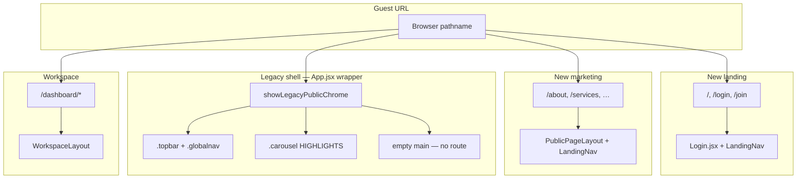

# Legacy public shell — undefined routes & HIGHLIGHTS carousel

**Purpose:** Explain the old public page shell (TCP header, legacy nav, stacked “HIGHLIGHTS” blocks) that appears when a URL has **no matching React route**, and how it differs from the new landing and marketing pages.

**Audience:** NIC developers debugging “wrong page” reports, blank content, or broken carousel layout.

**Last updated:** 2026-08-13

**Related docs:**

- [app-routes.md](./app-routes.md) — full route map and catch-all footguns
- [legacy-code-map.md](./legacy-code-map.md) — post-login legacy (`WorkspaceLegacyFrame`, `pages/dashboard/*`)
- [frontend-modernization-roadmap.md](./frontend-modernization-roadmap.md) — migration direction

---

## One-sentence truth

**Fixed (2026-08-13):** Unknown URLs render `pages/NotFound.jsx` (public) or `WorkspaceNotFound` (dashboard). The legacy HIGHLIGHTS carousel / `.topbar` / `.globalnav` block was **removed from `App.jsx`**. Old `/dashboard/:formType` bookmarks redirect to `/dashboard/forms/:formType`.

---

## What you see (symptoms)

Typical appearance when hitting an undefined path as a guest:

| UI piece | Source | Notes |
| -------- | ------ | ----- |
| TCP emblem + “Directorate of Town and Country Planning” | `App.jsx` → `.topbar` | Legacy header |
| Nav: Home, About, Public dashboard, Login, Registration, Contact Us | `App.jsx` → `.globalnav` | Not the new `LandingNav` |
| Four stacked **HIGHLIGHTS** sections | `App.jsx` → `.carousel.carousel--rent-banner` | All slides visible at once |
| Large vertical gaps / empty body below | No route match | `<main>` renders nothing |
| Blue pill dots under each title | `.carousel-dot` | Carousel nav without working slide layout |

**Slide copy** (i18n keys in `frontend/src/i18n/messages/en.js`):

1. `carousel.slide1Title` — Housing & tenancy in one place  
2. `carousel.slide2Title` — Digital Tenancy Registration  
3. `carousel.slide3Title` — Property & tenancy records  
4. `carousel.slide4Title` — Transparent, accessible services  

---

## When it appears

Controlled by `showLegacyPublicChrome` in `frontend/src/App.jsx`:

```js
const showLegacyPublicChrome =
  !user &&
  !usesLandingChrome &&
  !isDashboardRoute &&
  !loggingOut &&
  !isJoinEntry
```

| Condition | Meaning |
| --------- | ------- |
| `!user` | Guest session only |
| `!usesLandingChrome` | Path is **not** `/`, `/login`, `/join`, or a modern marketing page |
| `!isDashboardRoute` | Path does **not** start with `/dashboard` |
| `!loggingOut` / `!isJoinEntry` | Not during logout or join redirect |

### Paths that use the **new** public UI (no legacy shell)

**Landing (login / get started):** `/`, `/login`, `/join`

**Modern marketing** (`isPublicMarketingPath` in `frontend/src/utils/skipNavigation.js`):

- `/about`
- `/services`
- `/policies`
- `/resources`
- `/contact`
- `/public-dashboard`
- `/sitemap`

These use `PublicPageLayout` + `LandingNav` inside each page component.

### Paths that trigger the legacy shell

Any other guest URL with **no route**, for example:

- `/guidelines`, `/feedback`, `/help-centre` (linked in commented footer in `App.jsx` but **never routed**)
- Typos: `/abot`, `/dashbord`, `/logn`
- Old bookmarks to removed paths

### Logged-in users on unknown paths

- Legacy carousel **does not** show (`showLegacyPublicChrome` is false).
- If path is not `/dashboard/*`, user may see legacy `.globalnav` (welcome + logout) with empty main — still no 404.

### Dashboard paths without login

- `/dashboard/*` → `ProtectedRoute` redirects to `/login` (new landing), not the legacy shell.

---

## Why the carousel looks broken

The carousel is meant to show **one slide at a time** via `.carousel-banner-slide.is-active`.

Base layout CSS for `.carousel-banner`, `.carousel-banner-slide`, and positioning was **removed** from `App.css` (only a small mobile `min-height` override remains around line ~17853). Without those rules, all four slides stack vertically — which matches the “so spaced” report.

**Newer equivalent (working CSS):** `PublicPageHero.jsx` + `.public-page-hero__*` styles in `App.css`. That hero is only used when a page passes `showHero` to `PublicPageLayout` — not on the legacy fallback shell.

---

## Architecture: three public UI layers



| Layer | Where defined | Used for |
| ----- | ------------- | -------- |
| **New landing** | `pages/Login.jsx`, landing components | `/`, `/login` |
| **New marketing** | `components/landing/PublicPageLayout.jsx` | About, Services, Contact, etc. |
| **Legacy public shell** | `App.jsx` (wrapper around `<Routes>`) | Fallback for unmatched guest paths |
| **Workspace** | `workspace/layout/WorkspaceLayout.jsx` | All `/dashboard/*` |

---

## Legacy code inventory (public side)

| File / symbol | Role | Still needed? |
| ------------- | ---- | ------------- |
| `App.jsx` → `showLegacyPublicChrome` | Gate for legacy chrome | Fallback only — candidate for removal |
| `App.jsx` → `.topbar`, `.globalnav` | Old header + nav | Replace with redirect to `/` or 404 |
| `App.jsx` → `.carousel.carousel--rent-banner` | Old HIGHLIGHTS carousel | Broken CSS; duplicate of hero messaging |
| `App.jsx` → commented `.footer` | Dead links to unrouted paths | Delete or wire routes |
| `components/landing/PublicPageHero.jsx` | New hero carousel | Optional on marketing pages (`showHero`) |
| `utils/skipNavigation.js` → `PUBLIC_MARKETING_PATHS` | Which paths skip legacy shell | Keep; extend if adding pages |
| `pages/Admin.jsx` + `/admin` | Old states/districts/users CRUD | Separate from workspace; see app-routes.md |

**Post-login legacy** (different topic — admin lists, forms inside workspace) is documented in [legacy-code-map.md](./legacy-code-map.md).

---

## Route gap: no catch-all

`App.jsx` `<Routes>` ends without `path="*"`:

- Matched path → page component renders inside `<main>`
- Unmatched path → **nothing** in `<main>`, but App shell (legacy or landing wrapper) still renders

There is no dedicated NotFound / 404 component.

---

## Common debugging scenarios

| User report | Likely cause |
| ----------- | ------------ |
| “HIGHLIGHTS page with lots of empty space” | Undefined guest URL + legacy shell + broken carousel CSS |
| “Clicked link and got blank page” | Unrouted path; check commented footer links or old docs |
| “About works but Guidelines doesn’t” | `/about` is routed; `/guidelines` is not |
| “Logged in and URL is wrong” | Empty main; may still show old `.globalnav` welcome bar |
| “Assistant inbox link broken” | Usually a **defined** dashboard route issue — see app-routes.md, not this shell |

---

## Recommended fixes (priority)

| Priority | Action | Outcome |
| -------- | ------ | ------- |
| **High** | Add `<Route path="*" element={<NotFound />} />` (guest-friendly) | Clear “page not found” instead of empty main |
| **High** | Remove `showLegacyPublicChrome` block **or** redirect unknown guest paths to `/` | Stops legacy HIGHLIGHTS flash |
| **Medium** | Restore `.carousel-banner` CSS **only if** keeping legacy shell temporarily | Fixes stacked slides |
| **Medium** | Delete commented footer links or add real routes for `/guidelines`, `/feedback`, `/help-centre` | Stops false expectations |
| **Low** | Consolidate public UI under one layout parent in React Router | Less conditional logic in `App.jsx` |

---

## Key file references

| Topic | Location |
| ----- | -------- |
| Legacy shell gate + carousel JSX | `frontend/src/App.jsx` (~lines 131–137, 352–447) |
| Marketing path allowlist | `frontend/src/utils/skipNavigation.js` |
| Carousel i18n strings | `frontend/src/i18n/messages/en.js` (`carousel.*`) |
| New public page wrapper | `frontend/src/components/landing/PublicPageLayout.jsx` |
| New hero (working carousel) | `frontend/src/components/landing/PublicPageHero.jsx` |
| Legacy carousel CSS gap | `frontend/src/App.css` (search `carousel-banner`) |
| Full route list | [app-routes.md](./app-routes.md) |

---

## Quick checklist

Before editing public chrome, ask:

1. **Is the path actually defined in `App.jsx`?** If not, you are fixing a fallback shell, not a page component.
2. **Is the user logged in?** Legacy carousel only shows for guests on non-marketing paths.
3. **Should this be a new marketing page?** Add route + `PublicPageLayout`, and add path to `PUBLIC_MARKETING_PATHS` if it should skip legacy chrome.
4. **Is this post-login admin/forms?** See [legacy-code-map.md](./legacy-code-map.md) instead.

---

*When changing `showLegacyPublicChrome`, marketing paths, or adding a 404 route, update this file and [app-routes.md](./app-routes.md) in the same PR.*
