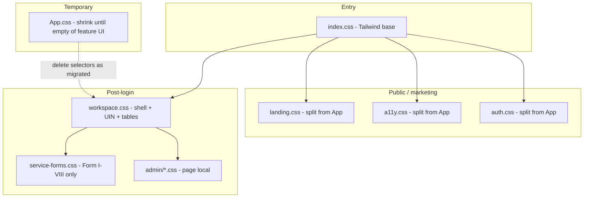

# CSS Architecture Plan

**Purpose:** Inventory every active frontend stylesheet, rate organization and conflict risk, and define a phased plan to eliminate overlapping legacy CSS—especially around Apply UIN / tenancy forms and the workspace shell.

**Audience:** NIC frontend maintainers, reviewers, future agents.

**Last reviewed:** 2026-07-16

**Related docs:**

- [frontend-modernization-roadmap.md](./frontend-modernization-roadmap.md) — page/route migration; this doc owns **styles only**
<!-- - [css-cleanup-checklist.md](./css-cleanup-checklist.md) — short progress checklist -->
- [backend-architecture.md](./backend-architecture.md) — API context (not CSS)

---

## Executive summary

The frontend has **8 active CSS files** and roughly **~21,000 lines** of CSS. Nearly **75%** lives in a single legacy mega-file (`App.css`). Newer post-login UI correctly targets `workspace.css`, but shared class names (`.tenancy-form`, `.tenancy-fieldset`, `.form-actions`) and cascade-order bugs still cause blank pages, ignored mobile padding, and half-width grids on Apply UIN.

**Direction:** Treat `workspace.css` as the **source of truth for logged-in UI** (including UIN). Freeze growth of `App.css`, split it by domain, delete dead selectors, and enforce one breakpoint map.

---

## Inventory (as-is)

| # | File | Approx. lines | Imported by | Role |
| - | ---- | ------------: | ----------- | ---- |
| 1 | `frontend/src/App.css` | ~14,900 | `App.jsx` (global) | Landing, a11y, auth, print, **legacy tenancy**, gov preview |
| 2 | `frontend/src/workspace/styles/workspace.css` | ~5,100 | `App.jsx` + `WorkspaceLayout.jsx` | Shell, dashboard, **UIN wizard**, tables, modals |
| 3 | `frontend/src/styles/service-forms.css` | ~486 | `App.jsx` (global) | Form I–VIII service panels |
| 4 | `frontend/src/index.css` | ~100 | `main.jsx` | Tailwind / base entry |
| 5 | `…/admin/ApplicationDetails.css` | ~360 | page-local | Admin application detail |
| 6 | `…/admin/UserManagement.css` | ~202 | page-local | Admin users |
| 7 | `…/admin/DistrictManagement.css` | ~125 | page-local | Admin districts |
| 8 | `…/admin/ApplicationList.css` | ~91 | page-local (shared) | Admin list tables |

**Not counted as source of truth:** build output under `frontend/dist/assets/*.css`.

### Load order (runtime)

```text
main.jsx  →  index.css
App.jsx   →  App.css  →  service-forms.css  →  workspace.css
```

Equal-specificity conflicts are won by **whoever loads last** (`workspace.css`), unless `App.css` uses higher specificity or `!important`.

---

## Organization rating

| File / area | Organization | Notes |
| ----------- | ------------ | ----- |
| `index.css` | **Good** | Thin entry; leave alone |
| `service-forms.css` | **Good** | Scoped to service form pages |
| `admin/*.css` | **Good** | Page-local; small |
| `workspace.css` | **Fair** | Clear domain, but growing fast; some duplicate media blocks historically |
| `App.css` | **Poor** | Monolith: landing + a11y + auth + tenancy + print; ~170 `@media`, ~750 `!important` |

### Composite styles maintainability: **4.5 / 10**

Strong for **new** workspace features if discipline holds; weak because **App.css still owns shared tenancy selectors** used by UIN.

---

## Conflicting / old code assessment

### How much?

| Category | Estimate | Meaning |
| -------- | -------- | ------- |
| Overlapping live tenancy/UIN rules | **~1,000–2,000 lines** | Same concepts styled in both App + workspace |
| Dead / unused stepper & orphan media | **~100–300 lines** | e.g. old `.tenancy-steps` (removed/unused on UIN) |
| High-risk `!important` surface | **~750 hits in App.css** | Mostly a11y/print; some form disabled styles punched through UIN |

This is **not** “half the CSS is garbage.” It is a **concentrated conflict zone** around forms + UIN + actions.

### Active conflict zones

| Area | Files | Symptom if broken | Status (2026-07-16) |
| ---- | ----- | ----------------- | ------------------- |
| UIN form chrome / padding | App ↔ workspace | Mobile padding ignored (base rule after `@media`) | **Fixed** (base moved before media) |
| Form actions / disabled buttons | App ↔ workspace | Grey `!important` disabled; margin wars | **Partly fixed** (scoped `:not(.ws-uin-apply)`) |
| Fieldset + form-grid | App ↔ workspace | Eligibility half-width; double 2-col grids | **Partly fixed** (UIN fieldset 1-col; nested grid 2→1 under 1280) |
| Dual steppers | App (dead) vs workspace (live) | Confusion / dead CSS weight | **Fixed** for UIN (horizontal-stepper only) |
| Breakpoint drift | App / workspace / shell | 1023 shell vs 1279 UIN vs 639/640 | **Open** |
| Shared `.tenancy-*` with Form I–VIII | service-forms ↔ App | Unintended inheritance | **Open** |

### Root causes

1. **Two eras of UI** without a clean cutover (legacy dashboard cards vs workspace).
2. **Shared class names** (`.tenancy-form`, `.tenancy-fieldset`, `.form-actions`) across UIN and service forms.
3. **Cascade order bugs** inside the same file (desktop base declared *after* mobile `@media`).
4. **No ownership rule** (“who may edit which file for which screen”).
5. **Breakpoint inconsistency** (laptop = 1280 for landing/UIN; shell drawer = 1024).

---

## Target architecture (to-be)



### Ownership rules (mandatory)

| Screen / surface | Allowed CSS file | Forbidden |
| ---------------- | ---------------- | --------- |
| Landing, public pages | `landing.css` (future) / remaining App landing sections | `workspace.css` |
| Logged-in shell, dashboards, UIN, Join | **`workspace.css` only** | New rules in `App.css` |
| Form I–VIII | **`service-forms.css` only** | Global `.tenancy-*` tweaks in App for “quick fixes” |
| Admin list/detail | matching `admin/*.css` | Global App dumps |
| Print / govt document preview | dedicated print section or `print.css` | Mixing into UIN layout rules |

### Breakpoint map (single source)

| Token | Width | Use for |
| ----- | ----- | ------- |
| `--bp-sm` | **640px** | Phones |
| `--bp-md` | **1024px** | Tablet / shell drawer |
| `--bp-lg` | **1280px** | “Smaller than laptop” content layout (UIN, landing nav) |

Pick **639 vs 640** once and use the same cutoff everywhere (prefer `max-width: 639px` / `min-width: 640px` pair).

---

## Phased fix plan

### Phase 0 — Stabilize UIN (in progress / near done)

**Goal:** Apply UIN and Join work on &lt;1280 without blank screens or ignored mobile CSS.

- [x] Horizontal stepper (replace dead `.tenancy-steps` path on UIN)
- [x] Move `.ws-uin-apply-form` base styles **before** `@media (max-width: 1279px)`
- [x] Scope App form-action / disabled styles away from `.ws-uin-apply`
- [x] UIN fieldset single-column; nested `.form-grid` responsive
- [ ] Smoke test: stage 1–5 on 375 / 768 / 1024 / 1280 / 1440 widths
- [ ] Smoke test: Join application stepper + payment

**Exit criteria:** No UIN layout bug reproducible by CSS conflict; sticky stepper + full-width actions under 1280.

---

### Phase 1 — Freeze `App.css` growth

**Goal:** Stop the bleed.

- [ ] Team rule: **no new selectors** in `App.css` except critical a11y/print hotfixes
- [ ] PR checklist item: “CSS file ownership respected”
- [ ] Document in PR template / AGENTS note if used

**Exit criteria:** New features land only in `workspace.css`, `service-forms.css`, or page-local admin CSS.

---

### Phase 2 — Delete dead & duplicate selectors

**Goal:** Reduce conflict surface without a big rewrite.

- [ ] Confirm no remaining JSX uses `.tenancy-steps` / `.tenancy-step` (except headings)
- [ ] Remove duplicate `@media` blocks that restate the same UIN rules in `App.css`
- [ ] Grep for orphaned classes: `upload-grid` (900px), unused dashboard-card form mins on UIN
- [ ] Keep `.tenancy-step-heading` (Join still uses it)

**Exit criteria:** Grep shows zero dead stepper rules; UIN action width defined in **one** place (`workspace.css`).

---

### Phase 3 — Split `App.css` by domain

**Goal:** Make the mega-file navigable; enable safe deletion later.

Suggested split (mechanical move first, behavior unchanged):

| New file | Content to extract from App.css |
| -------- | ------------------------------- |
| `styles/landing.css` | Portal services, benefits, FAQ, hero, wallpaper |
| `styles/a11y.css` | Contrast, font size, skip links, Assam a11y bar |
| `styles/auth.css` | Login/register cards |
| `styles/tenancy-legacy.css` | Old tenancy certificate / preview leftovers |
| `styles/print.css` | `@media print` + govt-form print overrides |
| `App.css` | Temporary re-exports / thin leftovers only |

Import order in `App.jsx` should remain stable until workspace fully owns forms.

**Exit criteria:** `App.css` &lt; ~2k lines or only `@import`s; no behavior regressions on landing + login.

---

### Phase 4 — Namespace tenancy form classes

**Goal:** Stop Form I–VIII and UIN from sharing ambiguous globals.

| Today | Target |
| ----- | ------ |
| `.tenancy-form` on UIN | `.ws-uin-apply-form` only (drop dual class if possible) |
| `.tenancy-fieldset` on UIN | `.ws-uin-fieldset` or scope under `.ws-uin-apply` |
| `.tenancy-form` on Form I–VIII | keep under `.service-form-page` / `.service-form-panel` |

Prefer **scoping** (`.ws-uin-apply .tenancy-fieldset`) before a large JSX rename; rename in a dedicated PR if needed.

**Exit criteria:** Changing service-forms CSS cannot break Apply UIN and vice versa.

---

### Phase 5 — Breakpoint + token cleanup

**Goal:** One responsive language.

- [ ] Align shell drawer (`1024`) vs content (`1280`) in a short comment block at top of `workspace.css`
- [ ] Replace ad-hoc 900 / 720 / 520 media queries that only exist for dead layouts
- [ ] Prefer CSS variables for spacing on UIN (`--ws-uin-pad`, etc.)

**Exit criteria:** Documented breakpoint table matches actual media queries for shell + UIN + landing nav.

---

### Phase 6 — Optional: CSS Modules / Tailwind-first for new pages

**Goal:** Long-term, new workspace features avoid global class wars.

- New pages: prefer existing `ws-*` patterns or Tailwind utilities already in the project
- Do **not** introduce a third parallel system (e.g. CSS Modules + BEM + ws-) without a decision record

---

## Testing checklist (CSS regressions)

Run after each phase:

| Flow | Widths | Pass if |
| ---- | ------ | ------- |
| Apply UIN stages 1–5 | 375, 768, 1279, 1280+ | Stepper usable; fields full width; actions sticky/full width under 1280 |
| Join application | same | Same as UIN |
| Form I (service) | 768, 1280 | Unaffected by UIN CSS changes |
| Landing services / benefits | 1279, 1280 | Landing-only CSS unchanged |
| Admin application list | 1024 | Admin page-local CSS unchanged |
| Print preview (govt form) | print | Document still printable |

---

## Metrics to track

| Metric | Baseline (2026-07-16) | Target after Phase 3 |
| ------ | --------------------: | --------------------: |
| Active CSS files | 8 | 8–12 (split is OK if owned) |
| `App.css` lines | ~14,900 | &lt; 2,000 or imports-only |
| `!important` in App.css | ~750 | ↓ for form/UI chrome; a11y may keep some |
| UIN rules defined in App.css | several | **0** |
| Duplicate UIN media blocks | multiple historically | **1** (workspace only) |

---

## What we will not do

- Big-bang delete of `App.css` in one PR
- Restyle the entire portal while “just fixing CSS”
- Add new UIN layout rules back into `App.css`
- Introduce another global mega-file

---

## Immediate next actions (this sprint)

1. Finish Phase 0 smoke tests on Apply UIN / Join across widths.
2. Add Phase 1 freeze rule to the team PR checklist.
3. Open a Phase 2 PR: delete remaining dead tenancy-step / duplicate App media for UIN actions.
4. Schedule Phase 3 split of `App.css` as a dedicated refactor ticket (no feature work mixed in).

---

## Appendix A — Quick grep commands

```bash
# UIN rules still in App.css?
rg "ws-uin-|tenancy-certificate-page|tenancy-form \.form-actions" frontend/src/App.css

# Dead stepper?
rg "tenancy-steps|tenancy-step-icon" frontend/src --glob "*.{css,jsx}"

# Who imports CSS?
rg "import ['\"].*\\.css" frontend/src --glob "*.{jsx,js}"
```

## Appendix B — Decision log

| Date | Decision |
| ---- | -------- |
| 2026-07-16 | `workspace.css` is source of truth for Apply UIN / Join layout |
| 2026-07-16 | Content “below laptop” = **max-width 1279px**; shell drawer remains **1023/1024** |
| 2026-07-16 | Scope App form-action chrome with `:not(.ws-uin-apply)` rather than fighting `!important` indefinitely |
