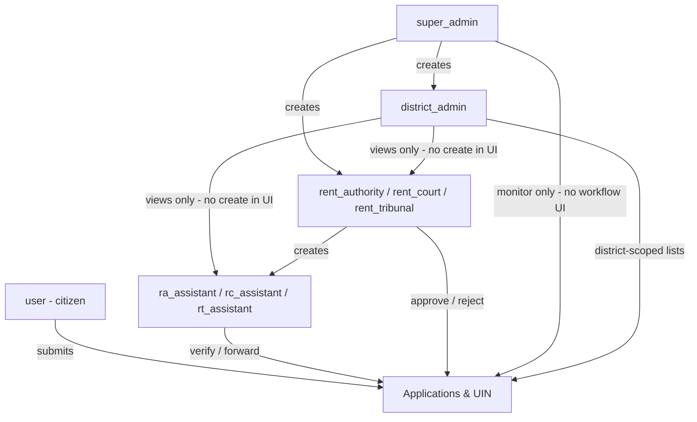

# Super Admin — Powers Reference (Prototype)

**Purpose:** Single reference for what the **super admin** (`super_admin`) role can do today in this prototype, how that differs from other roles, and what we should **add**, **improve**, or **remove** before production.

**Last reviewed:** 2026-06-03 (codebase snapshot)

**Related docs:**

- [Demo_NIC_Credentials.md](../Demo_NIC_Credentials.md) — login flow, demo OTP, role matrix (some UI items listed there are **not** wired yet; see gaps below)
- [docs/backend-architecture.md](../docs/backend-architecture.md) — API and data model overview

---

## Demo access

| Field | Value |
| ----- | ----- |
| Role | `super_admin` |
| Phone (login) | `9999999999` |
| Email (reference) | `admin@nic.in` |
| OTP (demo) | `123456` |

Sign-in: phone + OTP via `POST /api/login`. Password fallback exists for backward compatibility only.

**Scope label in UI:** “Statewide (Assam)” — data is not filtered by `district_id`; super admin sees **all districts** and **all applications**.

---

## Role position in the system



Super admin is a **platform operator**: master data, accounts, and **read-only oversight** of applications—not a desk officer in the RA/RC/RT workflow.

---

## Current powers

### 1. Workspace navigation (sidebar)

Routes under `/dashboard` for `super_admin` today:

| Nav item | Path | Notes |
| -------- | ---- | ----- |
| Dashboard | `/dashboard` | `SuperAdminDashboard` + statewide stats |
| User management | `/dashboard/admin/users` | Staff + citizens (`?mode=tenant` for citizens) |
| Service applications | `/dashboard/admin/applications` | All forms, all districts |
| Tenancy applications | `/dashboard/admin/tenancy` | UIN / tenancy records |
| Districts | `/dashboard/admin/districts` | Add / deactivate districts |
| States | `/dashboard/admin/states` | State master data |
| Offices | `/dashboard/admin/offices` | Circle / district offices |
| Designations | `/dashboard/admin/designations` | Staff titles |
| Roles | `/dashboard/admin/roles` | Role labels (not login keys) |
| Activity log | `/dashboard/admin/activity-log` | Searchable staff actions |
| My profile | `/dashboard/profile` | Same as other roles |

**Not in sidebar:** Application inbox (assistants), UIN apply/status (citizen flow).

Source: `frontend/src/workspace/config/navigation.js`

---

### 2. Dashboard & monitoring

| Capability | API | UI |
| ---------- | --- | -- |
| Statewide dashboard stats | `GET /api/dashboard-stats` (**super admin only**) | `SuperAdminDashboard`, `OfficialOverview` |
| Recent activity snippet | `GET /api/activity-logs` | `ActivityFeed` on super admin dashboard; legacy `DashboardHome` also loads logs |
| Charts / district map / form breakdown | Included in stats payload | Shown on super admin dashboard |
| Quick actions | — | Users, service apps, tenancy, districts, offices, activity log |

Stats include (among others): states, districts, offices, roles, designations, user counts, tenancy + service application counts, status pipeline, district breakdown.

Source: `backend/app/Services/DashboardStatsService.php`, `backend/app/Http/Controllers/DashboardController.php`

---

### 3. Master data (API: super admin only)

| Resource | Endpoints | UI today |
| -------- | --------- | -------- |
| Districts | `GET/POST/PUT/DELETE /api/districts` | **Yes** — `DistrictManagement` |
| Offices | `/api/offices` (apiResource) | **Yes** — `/dashboard/admin/offices` |
| Designations | `/api/designations` | **Yes** — `/dashboard/admin/designations` |
| Roles | `/api/roles` | **Yes** — `/dashboard/admin/roles` (label CRUD; login RBAC still uses system keys) |
| States | Public `GET /api/public/states`; admin `apiResource /api/states` | **Yes** — `/dashboard/admin/states` |

Quick action copy says “Districts & states” and “offices, roles, and designations,” but the linked screen is **districts only**.

---

### 4. User & account management

| Capability | Backend | Frontend |
| ---------- | ------- | -------- |
| List all users (no district filter) | `GET /api/users` | User management table |
| View / edit user | `GET/PUT /api/users/{id}` | `/users/:id` (`UserDetail`) — loads offices, designations, roles via super-admin APIs |
| Create user | `POST /api/users` | **Limited roles in UI** (see below) |
| Delete user | `destroy` exists; **no DELETE route** (by design — deactivate instead) | Removed from `UserDetail`; use Activate / Deactivate |
| Approve pending registration | `UserManagementController::approve` | Super admin **Approve** on `UserDetail` — `POST /api/users/{id}/approve` |
| Deactivate / activate account | `toggleBlock` | Users list + `UserDetail` — `POST /api/users/{id}/toggle-block` (reason required when deactivating). Accounts are not deleted. |

**Create-user UI restriction (super admin):** only `district_admin` and principal roles (`rent_authority`, `rent_court`, `rent_tribunal`). Assistants and other super admins are **not** in the dropdown, even though the controller comment says “Super admin can create anyone.”

Source: `frontend/src/pages/dashboard/admin/UserManagement.jsx` (`getAllowedRoles`), `backend/app/Http/Controllers/UserManagementController.php`

**Shared with district admin & principals:** management middleware `Roles::allManagement()` — super admin is included.

**District admin difference:** user list filtered to their district; cannot create staff in UI (`getAllowedRoles` returns `[]`).

---

### 5. Applications & tenancy (oversight)

| Capability | Super admin | District admin |
| ---------- | ----------- | -------------- |
| All service applications (statewide) | `GET /api/admin/applications/all` | Same endpoint, **filtered by district** |
| Tenancy / UIN records | `GET /api/admin/tenancy-records` | District-scoped |
| View application by number | `GET /api/admin/applications/{applicationNo}` | District check unless super admin |
| Inbox (assistant queue) | API: **403** (`Only assistants`) | N/A |
| Forward / approve / reject | API: **403** (assistants / principals only) | Same |
| Workflow buttons in list UI | **Hidden** — view only | Shown for assistants / principals |

Super admin uses the **“all applications”** list with **View** only (`ApplicationList.jsx`).

---

### 6. What super admin does **not** do (by design today)

- Citizen flows: register tenancy, submit Assam Tenancy Act forms, UIN status tracking (no `UIN status` nav item).
- Assistant inbox: verify and forward submissions.
- Principal decisions: approve or reject service applications (no UI; API would reject anyway).
- District-scoped staff creation (that is principals / super admin for heads, not DA in UI).

---

## Comparison: super admin vs district admin

| Area | Super admin | District admin |
| ---- | ----------- | -------------- |
| Geographic scope | All districts | Assigned `district_id` only |
| Dashboard API | `/api/dashboard-stats` | `/api/staff-dashboard-stats` |
| District CRUD | Yes | No |
| Offices / roles / designations CRUD (API) | Yes | No |
| Activity logs (API) | Yes | No |
| Create staff in UI | DA + RA/RC/RT heads only | No (view staff directory only) |
| Service applications | Statewide list | District list |
| Workflow actions | No | No (DA is not principal/assistant) |

---

## Gaps and inconsistencies (fix or document)

1. ~~**`Demo_NIC_Credentials.md` §5** lists State / Office / Role / Activity Log as super-admin screens — **most are not routed**~~ **Done:** workspace routes + sidebar under Master data.
2. ~~**Approve / block user** — routes missing~~ **Done:** `POST /api/users/{user}/approve` and `toggle-block` are registered; UI deactivates instead of deleting.
3. ~~**“Districts & states” quick action** — only districts implemented~~ **Done:** states + offices + activity log screens exist.
4. ~~**Dead imports** in `App.jsx`~~ **Done:** pages live under `workspace/pages/admin/` and are routed.
5. **User create mismatch** — backend allows any role for super admin; UI restricts to DA + principals; assistants must be created by principals (or fix UI).
6. ~~**No audit UI**~~ **Done:** `/dashboard/admin/activity-log`.
7. **No RBAC on user delete/update** — `destroy` / `update` have no extra checks beyond `managementRoles` middleware (any principal could delete users in API unless tightened).
8. **Demo auth** — fixed OTP; not suitable for production.
9. **Legacy `UserDetail`** — old dashboard layout links; super admin primary path is workspace.

---

## Recommended changes

### Add

| Item | Rationale |
| ---- | --------- |
| ~~Register approve / toggle-block routes~~ | Done — see User management above |
| ~~Workspace routes + nav for **Offices**, **Designations**, **Roles**~~ | Done — sidebar Master data |
| ~~**Activity log** page~~ | Done — `/dashboard/admin/activity-log` |
| ~~**State master data**~~ | Done — `/dashboard/admin/states` + `/api/states` |
| Super admin UI to create **assistants** (optional) | Align with backend “create anyone” or document that only principals create assistants |
| **Assign / change district** on user create form | Required for DA and principals; validate against districts list |
| **Impersonation / support mode** (future) | Read-only view as district user for support (out of scope for prototype) |
| **Export** (users, applications CSV) | Operations and reporting |
| Production auth (real OTP, lockout, session policy) | Security |

### Improve

| Item | Rationale |
| ---- | --------- |
| Align **Demo_NIC_Credentials.md** with actual sidebar | Avoid stakeholder confusion |
| Single dashboard entry | `DashboardHome` vs `OfficialOverview` / workspace — reduce duplicate activity-log fetches |
| **Delete user** — confirm dialog, prevent deleting self / last super admin | Safety |
| **Role change guards** | Prevent demoting the only super admin or breaking district principal FKs |
| District delete rules | Block delete if users or open applications reference district |
| Application detail for super admin | Read-only banner: “Oversight only — processing happens in district workflow” |
| Consolidate master data under one **“Platform settings”** hub | Districts, offices, designations, roles, states |
| Server-side validation mirroring UI `getAllowedRoles` | Consistent permissions |

### Remove or defer

| Item | Rationale |
| ---- | --------- |
| Commented **StateManagement** import and unused admin pages **or** wire them — avoid dead code | Clarity |
| Misleading quick-action subtitle (“offices, roles, designations”) until pages exist | UX honesty |
| Granting super admin **workflow approve** in API middleware | `allAdminStaffRoles` includes super admin on workflow routes but methods return 403 — consider excluding `super_admin` from that middleware group to reduce attack surface |
| Legacy non-workspace **UserDetail** nav chrome | If workspace is canonical |
| Demo OTP `123456` in production builds | Security |

---

## API quick reference (super admin exclusive)

```
GET  /api/dashboard-stats
GET  /api/activity-logs
GET|POST|PUT|DELETE  /api/districts[/{id}]
GET|POST|PUT|DELETE  /api/offices[/{id}]
GET|POST|PUT|DELETE  /api/designations[/{id}]
GET|POST|PUT|DELETE  /api/roles[/{id}]
```

## API quick reference (shared with other management roles)

```
GET|POST       /api/users
GET|PUT|DELETE /api/users/{user}
GET            /api/admin/tenancy-records
GET            /api/admin/applications/all
GET            /api/admin/applications/{applicationNo}
GET            /api/admin/applications/{type}/{id}
```

## API quick reference (not available to super admin in practice)

```
GET  /api/admin/applications/inbox          → assistants only
GET  /api/admin/applications/principal-inbox → principals only
POST /api/admin/applications/.../forward    → assistants only
POST /api/admin/applications/.../approve    → principals only
POST /api/admin/applications/.../reject     → assistants + principals
```

---

## Key source files

| Area | Path |
| ---- | ---- |
| Role constants | `backend/app/Constants/Roles.php` |
| API routes | `backend/routes/api.php` |
| User management | `backend/app/Http/Controllers/UserManagementController.php` |
| Workflow | `backend/app/Http/Controllers/ApplicationWorkflowController.php` |
| Stats | `backend/app/Services/DashboardStatsService.php` |
| Workspace nav | `frontend/src/workspace/config/navigation.js` |
| Super admin dashboard | `frontend/src/workspace/pages/official/SuperAdminDashboard.jsx` |
| Districts UI | `frontend/src/pages/dashboard/admin/DistrictManagement.jsx` |
| Users UI | `frontend/src/pages/dashboard/admin/UserManagement.jsx` |

---

## Changelog (this document)

| Date | Note |
| ---- | ---- |
| 2026-06-03 | Initial reference from prototype codebase review |
